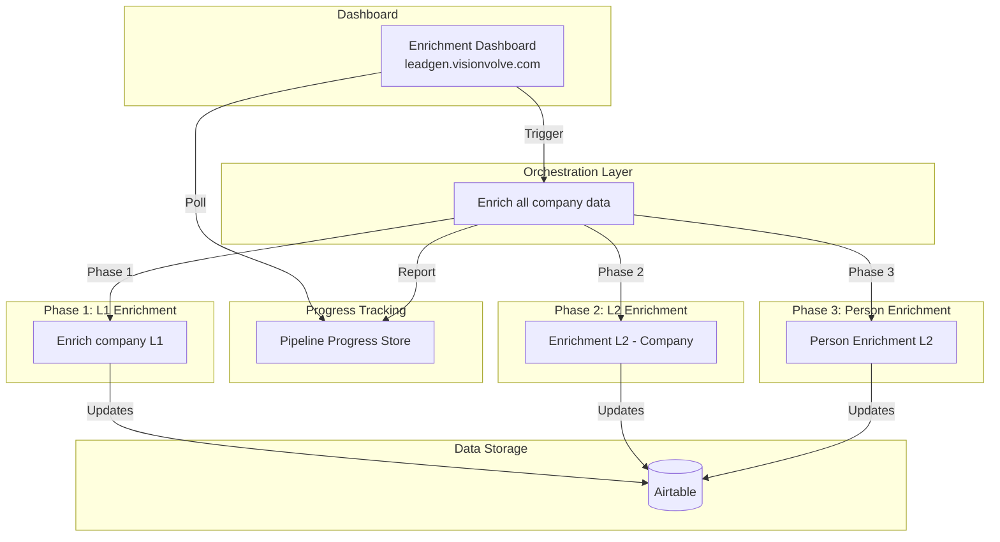
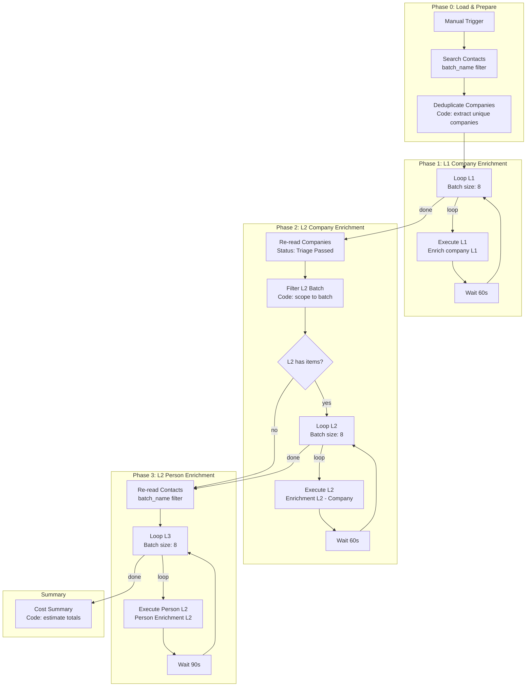
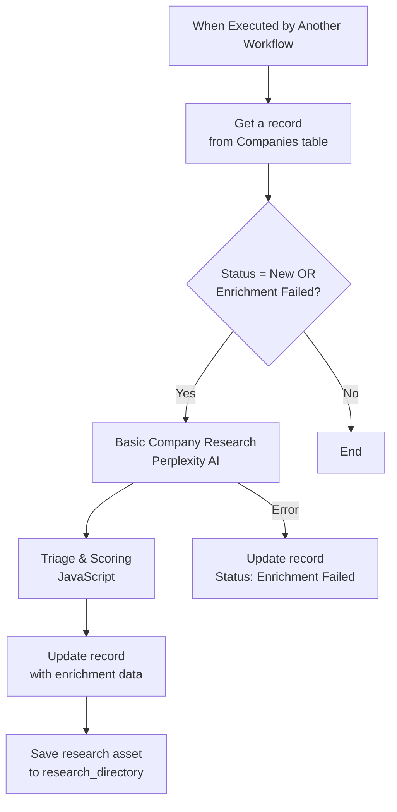
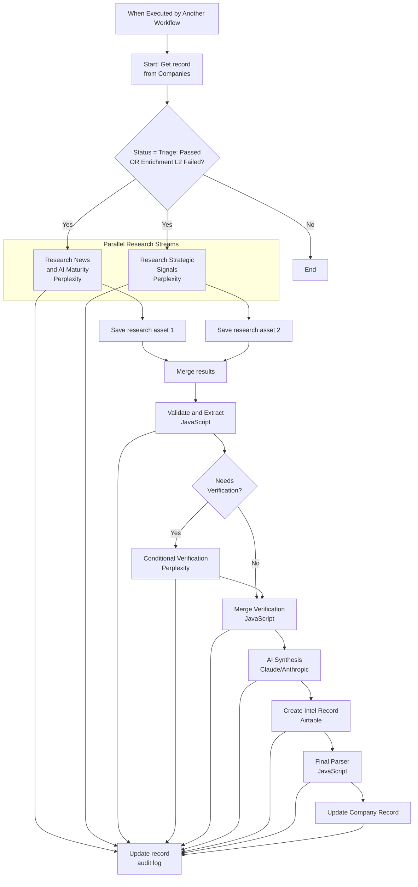
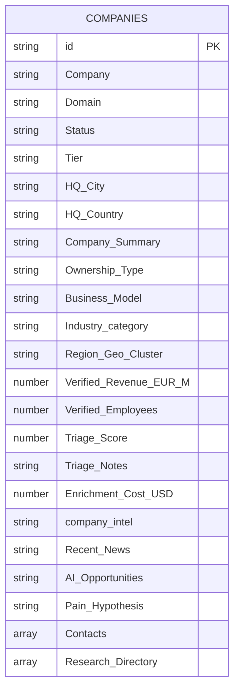
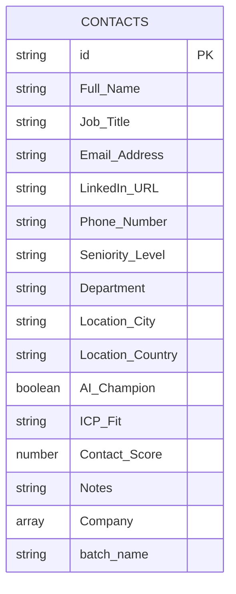
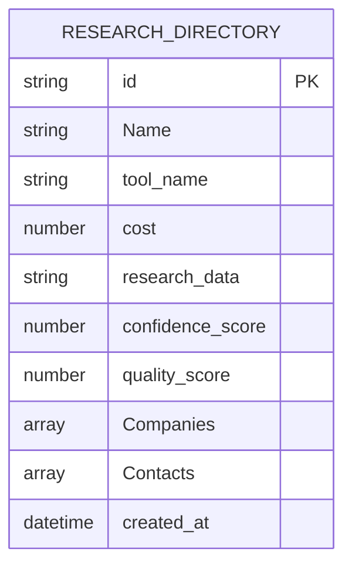
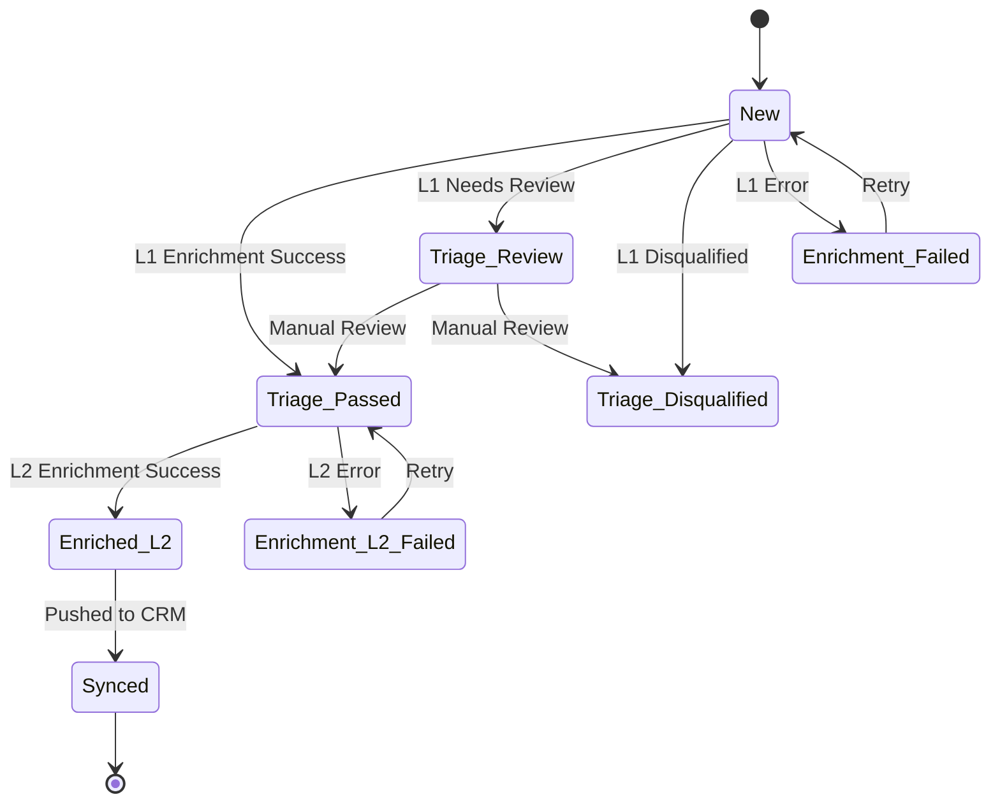

# Leadgen Pipeline Workflows

This document provides comprehensive documentation for all n8n workflows in the leadgen pipeline system. The system is designed for B2B sales lead enrichment, using AI-powered research to qualify and enrich company and contact data. n8n workflows currently read/write Airtable; dashboard APIs have been migrated to PostgreSQL.

## System Overview



---

## 1. Enrich all company data

**Workflow ID (hosted):** `N00qr21DCnGoh32D`
**Purpose:** Master orchestration workflow that coordinates the 3-phase enrichment pipeline for companies and contacts.

### Overview

This workflow is the main entry point for the enrichment pipeline. It loads contacts from a batch, deduplicates their companies, then runs enrichment in three sequential phases: L1 company enrichment, L2 company enrichment, and L2 person enrichment. Each phase processes items in batches of 8 with rate-limiting waits between batches.

### Trigger

| Trigger | Description |
|---------|-------------|
| Webhook | `POST /webhook/enrich-pipeline-v2` — triggered by dashboard or direct HTTP call |
| Manual Trigger | Manual execution from n8n UI |

### Webhook Parameters

| Parameter | Type | Default | Description |
|-----------|------|---------|-------------|
| `batch_name` | string | `batch-2-NL-NORDICS[OPS/FIN]` | Airtable batch name filter |
| `tier_filter` | string[] | `["Tier 2", "Tier 3"]` | Tier prefixes to include in L2 |
| `owner` | string | `Michal` | Filter contacts by Owner field |
| `skip_l1` | boolean | `false` | Skip L1 enrichment stage |
| `skip_l2` | boolean | `false` | Skip L2 enrichment stage |
| `skip_person` | boolean | `false` | Skip Person enrichment stage |

### Progress Reporting

The orchestrator reports progress to the **Pipeline Progress Store** workflow (`npfDHTJziukWz4aZ`) via HTTP POST to `/webhook/pipeline-progress`. Four report nodes send updates:
- **Report Init** — after Build State, before Gate Logic
- **Report L1** — after each L1 batch accumulation
- **Report L2** — after each L2 batch accumulation
- **Report Person** — after each Person batch accumulation

### Flow Diagram



### Node Details

| Node | Type | Description |
|------|------|-------------|
| Manual Trigger | Manual Trigger | Entry point |
| Search Contacts | Airtable Search | Finds contacts with `batch_name` and `Enrichment Status = New/blank` |
| Deduplicate Companies | Code | Extracts unique company record IDs from contacts' linked `Company` field |
| Loop L1 | Split In Batches | Processes 8 companies at a time for L1 |
| Execute L1 | Execute Workflow | Calls "Enrich company L1" (`oCCiiwvp7DYqoFb3`), `onError: continueErrorOutput` |
| Wait L1 | Wait | 60 second delay between L1 batches |
| Re-read Companies | Airtable Search | Re-reads companies with `Status = Triage: Passed` or `Enrichment L2 Failed` |
| Filter L2 Batch | Code | Cross-references re-read results against original batch company IDs |
| If L2 Has Items | If | Skips Phase 2 if no eligible companies |
| Loop L2 | Split In Batches | Processes 8 companies at a time for L2 |
| Execute L2 | Execute Workflow | Calls "Enrichment L2 - Company" (`cMYHH336qfXpZDwj`), `onError: continueErrorOutput` |
| Wait L2 | Wait | 60 second delay between L2 batches |
| Re-read Contacts | Airtable Search | Re-reads contacts with `batch_name` and `Enrichment Status = New/blank` |
| Loop L3 | Split In Batches | Processes 8 contacts at a time for Person L2 |
| Execute Person L2 | Execute Workflow | Calls "Person Enrichment L2" (`7a9lVChP2mpqVoIb`), `onError: continueErrorOutput` |
| Wait L3 | Wait | 90 second delay between L3 batches |
| Cost Summary | Code | Estimates total batch cost from item counts and known API rates |

### Error Handling

Three layers of error handling ensure the pipeline never stops on a single failure:

1. **Sub-workflow level:** Each sub-workflow sets failure statuses on Airtable records (`Enrichment Failed`, `Enrichment L2 Failed`) and uses `onError: continueErrorOutput` on API nodes
2. **Execute Workflow level:** All Execute Workflow nodes use `onError: continueErrorOutput` — both success and error outputs route to the Wait node
3. **Orchestrator level:** The `splitInBatches` loop continues regardless of individual item failures

### Cost Estimates

| Phase | API Calls | Est. Cost/Item |
|-------|-----------|---------------|
| L1 Company | 1 Perplexity (sonar) | ~$0.005 |
| L2 Company | 2-3 Perplexity (sonar-pro + sonar) | ~$0.015 |
| L2 Person | 2-3 Perplexity + 1 Claude Sonnet 4.5 | ~$0.030 |
| **Full pipeline** | **per company + 1 contact** | **~$0.050** |

Not all companies pass L1 triage (~60% pass rate), so effective per-record cost is lower. Actual costs are stored per-record in Airtable: `Enrichment Cost (USD)` on companies, `Enrichment Cost` on contacts.

### Configuration

- **Airtable Base:** AI Company Enrichment (`appFOpa3XSj5A70ZP`)
- **Companies Table:** `tblz8w67LPdeofgvw`
- **Contacts Table:** `tblWpp39X054tkp3C`
- **Batch Filter:** `batch-2-NL-NORDICS[OPS/FIN]`

---

## 2. Enrich company L1

**Workflow ID (hosted):** `oCCiiwvp7DYqoFb3` | **(cloud):** `57xNhzkp-KIXt8LSwG0Iz`
**Purpose:** Level 1 company enrichment - verifies and enriches basic company information using AI research.

### Overview

This workflow performs initial company research and qualification. It uses Perplexity AI to verify company basics and performs triage scoring to determine if a company should proceed to L2 enrichment.

### Input

| Parameter | Type | Description |
|-----------|------|-------------|
| `record_id` | string | Airtable record ID of the company to enrich |

### Flow Diagram



### Perplexity AI Research Prompt

The workflow uses a structured prompt to extract:

```json
{
  "company_name": "Official registered name",
  "summary": "What they do, 1-2 sentences max",
  "b2b": true/false,
  "hq": "City, Country",
  "markets": "Countries they operate in",
  "founded": "Year",
  "ownership": "Family/PE-backed/Public/Subsidiary/Founder-led",
  "industry": "Corrected industry",
  "business_model": "Manufacturer/Distributor/Service provider/SaaS/Platform",
  "revenue_eur_m": "Revenue in EUR millions",
  "employees": "Employee count",
  "confidence": "high/medium/low",
  "flags": ["list of issues"]
}
```

### Research Quality Rules

1. **Source Priority:** Official filings > Company website > Third-party databases > LinkedIn
2. **Parent vs Subsidiary:** Flags data that may belong to parent company
3. **Revenue/Employee Ratio:** Flags ratios above EUR 500K/employee as suspicious
4. **Conservative Approach:** "Unverified" is preferred over guessing

### Triage Scoring (JavaScript)

The Code node performs:
- Research quality control
- Tier requalification based on verified data
- Company size and revenue validation
- Status assignment (Passed/Review/Disqualified)

### Output Fields Updated

| Field | Description |
|-------|-------------|
| Status | Triage: Passed / Triage: Review / Triage: Disqualified |
| Company Summary | Brief company description |
| Tier | Recalculated tier based on research |
| HQ City / HQ Country | Verified headquarters location |
| Ownership Type | Bootstrapped/VC/PE/Public/Family/State |
| Triage Notes | Qualification notes |
| Triage Score | Numeric score |
| Verified Employees | Confirmed employee count |
| Verified Revenue (EUR M) | Confirmed revenue |
| Business Model | B2B/B2C/Marketplace/Gov/Non-profit |
| Region / Geo Cluster | DACH/Nordics/Benelux/CEE/UK/etc |
| Industry_category | Refined industry classification |
| Enrichment Cost (USD) | API cost tracking |

---

## 3. Enrichment L2 - Company

**Workflow ID (hosted):** `cMYHH336qfXpZDwj` | **(cloud):** `2reXa8HB6DIZkKIvk8Uyh`
**Purpose:** Level 2 deep company enrichment with news research, AI maturity assessment, and strategic signal detection.

### Overview

This advanced enrichment workflow performs deep research on companies that passed L1 triage. It runs parallel research streams, validates findings, and synthesizes insights using Claude AI.

### Input

| Parameter | Type | Description |
|-----------|------|-------------|
| `record_id` | string | Airtable record ID of the company to enrich |

### Flow Diagram



### Research Stream 1: News and AI Maturity

**Focus Areas:**
- Recent company news (last 12 months)
- Business signals indicating change, growth, or buying intent
- AI/ML initiatives and maturity level
- Digital transformation programs

**Critical Rules:**
- Date filtering: Only includes news from last 12 months
- Search disambiguation: Verifies company identity via domain/legal name
- Returns "None found" rather than including stale news

### Research Stream 2: Strategic Signals

**Focus Areas:**
- Leadership changes (CTO, CDO, VP Engineering, CAIO)
- Hiring signals (ML/AI roles)
- M&A activity
- Cost pressure / restructuring
- Innovation labs / AI hubs
- Cloud migration
- Funding rounds

### Validation Layer

The Switch node routes findings based on confidence:
- **High confidence:** Direct to synthesis
- **Low confidence:** Additional verification via Perplexity

### AI Synthesis (Claude/Anthropic)

Uses Claude to synthesize all research into actionable intelligence:
- Pain hypothesis
- AI opportunities
- Relevant case studies
- Buying stage assessment
- Recommended approach

### Output Fields Updated

| Field | Description |
|-------|-------------|
| Status | Enriched L2 / Enriched L2 Failed |
| company_intel | Full synthesized intelligence |
| Recent News | Latest relevant news |
| Strategic Signals (Recent) | Detected signals array |
| AI Opportunities | Identified AI use cases |
| Pain Hypothesis | Hypothesized pain points |
| Relevant Case Study | Matching case studies |
| Digital Initiatives | Ongoing digital programs |
| Leadership Changes | Recent leadership moves |
| Hiring Signals | AI/ML hiring activity |

---

## 4. Person Enrichment L2

**Workflow ID (hosted):** `7a9lVChP2mpqVoIb` | **(cloud):** `A-5plssw2dyg10eyDCh5_`
**Purpose:** Final enrichment step that prepares contact data for message generation - enriches individual contacts with person-specific intelligence and personalization data.

### Overview

This workflow enriches contacts whose company has been enriched to L2 status. It performs true person-level enrichment with cross-validation against company data, including role verification, AI champion detection, authority scoring, and relationship synthesis. Prepares personalization data for downstream message generation workflow.

### Input

| Parameter | Type | Description |
|-----------|------|-------------|
| `contact_id` | string | Airtable record ID of the contact to enrich |

### Eligibility

Only contacts where `Company.Status = "Enriched L2"` are processed.

### Flow Diagram

```mermaid
flowchart TD
    START[When Executed by Another Workflow<br/>Input: contact_id]
    GET_CONTACT[Get Contact Record<br/>Airtable: Contacts]
    GET_COMPANY[Get Company Record<br/>Airtable: Companies]

    IF_ELIGIBLE{Eligible?<br/>Company.Status = Enriched L2}

    subgraph ParallelResearch["Parallel Perplexity Research"]
        RESEARCH_PROFILE[Research Person Profile<br/>sonar-pro | temp: 0.2]
        RESEARCH_SIGNALS[Research Decision Signals<br/>sonar | temp: 0.2]
    end

    SAVE1[Save Profile Asset]
    SAVE2[Save Signals Asset]
    MERGE[Merge Results]

    VALIDATE[Validate & Score<br/>JavaScript<br/>- Cross-validate vs company L2<br/>- Contradiction detection<br/>- Contact scoring]

    SWITCH{Needs<br/>Verification?}

    VERIFY[Conditional Verification<br/>Perplexity sonar]

    MERGE_V[Merge Verification]

    SYNTH[Relationship Synthesis<br/>Claude Sonnet | temp: 0.7]

    PARSE[Final Parser<br/>JavaScript]

    UPDATE[Update Contact Record]
    SAVE_SYNTH[Save Synthesis Asset]
    UPDATE_ERR[Update Error Status]

    START --> GET_CONTACT --> GET_COMPANY --> IF_ELIGIBLE
    IF_ELIGIBLE -->|Yes| RESEARCH_PROFILE & RESEARCH_SIGNALS
    IF_ELIGIBLE -->|No| END_SKIP[End]

    RESEARCH_PROFILE --> SAVE1 --> MERGE
    RESEARCH_SIGNALS --> SAVE2 --> MERGE
    RESEARCH_PROFILE & RESEARCH_SIGNALS -->|Error| UPDATE_ERR

    MERGE --> VALIDATE --> SWITCH
    SWITCH -->|Contradictions| VERIFY --> MERGE_V
    SWITCH -->|Clean| MERGE_V
    MERGE_V --> SYNTH --> PARSE --> UPDATE & SAVE_SYNTH
```

### Parallel Research Nodes

| Node | Model | Temperature | Max Tokens | Purpose |
|------|-------|-------------|------------|---------|
| Research Person Profile | sonar-pro | 0.2 | 800 | Role verification, career trajectory, thought leadership |
| Research Decision Signals | sonar | 0.2 | 600 | AI champion indicators, authority signals, buying signals |

### Validate & Score Logic

The JavaScript validation node performs:

1. **Role Verification** - Checks if current role was verified by research
2. **Seniority Detection** - Parses job title into C-Level/VP/Director/Manager/IC
3. **Department Detection** - Maps title to Executive/Engineering/Product/Sales/etc.
4. **Cross-Validation** - Compares senior contacts against company leadership data from L2
5. **Department Alignment** - Checks if contact's department aligns with company pain hypothesis
6. **AI Champion Score (0-10)** - Based on evidence of AI/innovation interest
7. **Authority Score (0-10)** - Based on seniority and decision-making signals
8. **Contact Score (0-100)** - Composite score for prioritization
9. **ICP Fit** - Strong Fit / Moderate Fit / Weak Fit / Unknown

### Contradiction Detection

| Contradiction | Severity | Action |
|---------------|----------|--------|
| Role not verified | Warning | Route to verification |
| Title mismatch | Warning | Route to verification |
| Senior not in company leadership | Info | Flag only |
| Dept misaligned with pain | Info | Lower contact score |

### Relationship Synthesis (Claude Sonnet)

Prepares personalization data for downstream message generation:
- Personalization angle
- Connection points
- Pain connection to company hypothesis
- Conversation starters
- Objection prediction

**Note:** Actual message generation (LinkedIn, email, call scripts) is handled by a separate workflow.

### Output Fields Updated

| Field | Type | Source |
|-------|------|--------|
| Seniority Level | Select | Detected from title: C-Level/VP/Director/Manager/IC |
| Department | Select | Detected from title |
| AI Champion | Boolean | `true` if ai_champion_score >= 5 |
| ICP Fit | Select | Strong Fit/Moderate Fit/Weak Fit/Unknown |
| Contact Score | Number | 0-100 calculated score |
| Relationship Summary (AI) | Long Text | Synthesized personalization brief |
| Enrich LinkedIn Profile (AI) | Long Text | Career + expertise summary |
| Notes | Long Text | Enrichment flags and notes |

### Research Assets Saved

| Asset Name | Tool | Content |
|------------|------|---------|
| person_profile | perplexity_sonar-pro | Role verification, career, thought leadership |
| person_signals | perplexity_sonar | AI champion, authority, buying signals |
| person_synthesis | claude_sonnet | Personalization strategy and openers |

---

## Data Model

### Companies Table (`tblz8w67LPdeofgvw`)



### Contacts Table (`tblWpp39X054tkp3C`)



### Research Directory Table (`tbl4Y2QOz4EFeoEaI`)



---

## Status Flow



---

## Tier System

| Tier | Name | Description |
|------|------|-------------|
| Tier 1 | Platinum | Highest priority, best ICP fit |
| Tier 2 | Gold | High priority |
| Tier 3 | Silver | Medium priority |
| Tier 4 | Bronze | Lower priority |
| Tier 5 | Copper | Lowest priority |
| - | Deprioritize | Not worth pursuing |

---

## Cost Tracking

Each workflow tracks API costs:
- Perplexity API calls
- Claude/Anthropic API calls

Costs are stored in:
- `Enrichment Cost (USD)` field on Companies
- `cost` field in Research Directory entries

---

## Error Handling

All workflows implement:
1. **Conditional checks** before processing (status validation)
2. **Error branches** that update records with error messages
3. **Retry support** via status reset to original state
4. **Audit logging** via Update record1 nodes

---

## Configuration

### Environment Variables

```env
# Cloud instance (source)
N8N_API_TOKEN=<cloud-api-token>
N8N_SYNCED_PROJECTS=57xNhzkp-KIXt8LSwG0Iz,2reXa8HB6DIZkKIvk8Uyh,A-5plssw2dyg10eyDCh5_,EsnVgqWOp4YrHyG6

# Hosted instance (target)
N8N_HOSTED_URL=https://n8n.visionvolve.com/api/v1
N8N_HOSTED_API_TOKEN=<hosted-api-token>
```

### Airtable Configuration

- **Base ID:** `appFOpa3XSj5A70ZP`
- **Base Name:** AI Company Enrichment

### API Integrations

| Service | Purpose |
|---------|---------|
| Perplexity AI | Web research and verification |
| Anthropic Claude | AI synthesis and analysis |
| Airtable | Data storage and triggering |

---

## 5. Pipeline Progress Store

**Workflow ID (hosted):** `npfDHTJziukWz4aZ`
**Purpose:** Stateful progress store for the orchestrator — receives progress updates and serves them to the dashboard.

### Overview

A minimal 2-node workflow that uses n8n's `staticData` as an in-memory key-value store for pipeline run progress. The orchestrator POSTs progress updates after each batch, and the dashboard polls for the latest state.

### Webhook

`POST /webhook/pipeline-progress`

### Actions

| Action | Request Body | Response |
|--------|-------------|----------|
| `update` | `{action: "update", execution_id, batch_name, l1_done, l2_done, ...}` | `{ok: true, execution_id}` |
| `get` | `{action: "get", execution_id}` | `{ok: true, run: {...}}` |
| `list` | `{action: "list"}` | `{ok: true, runs: [...]}` (most recent 20) |

### Progress Fields

| Field | Type | Description |
|-------|------|-------------|
| `execution_id` | string | n8n execution ID |
| `batch_name` | string | Batch being processed |
| `owner` | string | Owner filter used |
| `total_companies` | number | Total companies in batch |
| `total_contacts` | number | Total contacts in batch |
| `l1_total` / `l1_done` | number | L1 stage progress |
| `l2_total` / `l2_done` | number | L2 stage progress |
| `person_total` / `person_done` | number | Person stage progress |
| `cost` | number | Accumulated API cost (USD) |
| `started_at` | string | ISO timestamp of run start |
| `status` | string | `running` or `completed` |
| `updated_at` | string | ISO timestamp of last update |

---

## 6. Enrichment Dashboard

**URL:** `https://leadgen.visionvolve.com/`
**Type:** Static HTML/JS/CSS (served by Caddy with namespace routing)

### Features

- Pipeline visualization with 8-node flow (Contacts → L1 → Triage → L2 → Person → Generate → Review → Ready)
- Trigger enrichment runs with configurable batch name, owner, tier filter, and stage skip toggles
- Real-time progress overlay polling the Pipeline Progress Store every 10 seconds
- Batch and owner selection populated from `/webhook/batch-list` API
- Stats loaded from `/webhook/batch-stats` API with tier breakdown and stage counts
- JWT authentication with namespace-based multi-tenancy

### Deployment

```bash
bash deploy/deploy-dashboard.sh
```

Copies `dashboard/` static files to VPS Caddy container and restarts Caddy.
