# Sprint 5 Breakdown: Seamless Flow

**Date**: 2026-03-03
**Status**: Planning complete, sub-sprints created in backlog
**Parent Plan**: `docs/plans/sprint-5-plan.md`
**Baseline Scores**: `tests/baseline-eval/scores.json` (baseline-001), `tests/baseline-eval/baseline-002/scores.json` (baseline-002)

---

## 1. Executive Summary

Sprint 5 "Seamless Flow" targets the transformation from isolated feature islands to a guided, AI-driven GTM workflow. The baseline test (baseline-001) scored 3.2/10 on workflow seamlessness and 2.6/10 on proactiveness -- the system has the building blocks but no connective tissue.

With 22+ items including an XL orchestrator, the full sprint is too large for a single pass. It has been split into **3 sub-sprints** to make implementation manageable, reduce risk, and enable measurable progress after each phase:

| Sub-Sprint | Theme | Items | Duration | Key Metric |
|------------|-------|-------|----------|------------|
| **5.1** | Debug Fixes + Deployment Pipeline | 4 | 1 session | Validate deployment, establish baseline-003 |
| **5.2** | Bug Fixes + AI Quality | 8 | 1-2 sessions | Completeness 6.7 -> 8.0, AI Quality 7.0 -> 8.5 |
| **5.3** | Integration + Proactive AI + Orchestration | 14+ | 2-3 sessions | Seamlessness 3.4 -> 8.0, Proactiveness 2.8 -> 8.0 |

The PM and EM challenge reviews (Sprint 5.1) established honest math: **Sprint 5 cannot reach 9/10**. The realistic aggregate after all three sub-sprints is **8.0-8.5/10**. Reaching 9/10 requires Sprint 6 work (auto-transitions, deep message personalization, closed-loop learning).

### Baseline Scores at Start

| Dimension | baseline-001 | baseline-002 | Delta |
|-----------|:-----------:|:----------:|:-----:|
| Overall Completeness | 6.0 | 6.7 | +0.7 |
| Workflow Seamlessness | 3.2 | 3.4 | +0.2 |
| AI Quality | 7.5 | 7.0 | -0.5 |
| User Effort | 7.2 | 7.4 | +0.2 |
| Proactiveness | 2.6 | 2.8 | +0.2 |

baseline-002 improvements: auto-execute tools (BL-150 partial), extraction toast notification, import crash fixed. Regressions: import preview 500 error, AI mapping not applied to dropdowns.

---

## 2. Sprint 5.1: Debug Fixes + Deployment Pipeline

**Theme**: Fix the deployment gap + 3 verified bugs from baseline testing
**Duration**: 1 session
**Specs**: `docs/plans/sprint-5.1-specs.md`
**PM Challenge**: `docs/plans/sprint-5.1-pm-challenge.md`
**EM Challenge**: `docs/plans/sprint-5.1-em-challenge.md`

### Why Sprint 5.1 Exists

Sprint 5's code was correct but never reached the browser. The `deploy-revision.sh` script deploys frontend builds to `/srv/dashboard-rev-{commit}` but never updates `/srv/dashboard-rev-latest`, which is what Caddy serves for the staging root URL. This single deployment gap caused 5 of 8 reported failures from baseline-001. The remaining 3 are: 2 backend bugs in `import_routes.py` (format mismatch between Claude's `entity.field` naming and the frontend's flat field naming) and 1 prompt engineering issue (web_search gated behind "FIRST MESSAGE" conditional).

### Items (4)

| # | Item | Title | Priority | Effort | Dependencies |
|---|------|-------|----------|--------|-------------|
| 1 | Deploy Fix | Fix deployment pipeline (dashboard not deployed to staging root) | Must Have | S | None |
| 2 | Import Fix | Fix import response format mismatch (Claude `entity.field` -> frontend flat field) | Must Have | S | None |
| 3 | Web Search Fix | Fix web search prompt (gated behind "FIRST MESSAGE" conditional) | Must Have | S | None |
| 4 | E2E Framework | E2E verification framework (`baseline-workflow.spec.ts`) | Must Have | M | Items 1-3 |

### Key Findings from Reviews

**EM Challenge (NEEDS REVISION on Items 1-2)**:
- **Import fix**: The spec's simple prefix-stripping rule (`company.X -> company_X`) is wrong for most company fields. `company.domain` should map to `domain` (not `company_domain`), `company.industry` to `industry` (not `company_industry`), `company.hq_city` to `location`, `company.company_size` to `employee_count`. An explicit bidirectional mapping table (`CLAUDE_TO_FRONTEND` / `FRONTEND_TO_CLAUDE`) is required. Also handle `email_address` vs `email` and `phone_number` vs `phone` variants.
- **Web search fix**: Prompt compliance is probabilistic, not deterministic. Even with "HARD RULE" and "CRITICAL REMINDER", AI may skip web_search in ~15% of turns. Realistic AI quality is 8, not 9. Programmatic enforcement (logging/warning in `agent_executor.py`) recommended.
- **Deploy fix**: Highest-impact single change. Correct, complete, and the score projection is honest. Verified that only `deploy-revision.sh` needs the fix.
- **E2E framework**: Sound. Minor improvements suggested (replace `networkidle` waits with element waits, add positive assertions alongside negative ones).

**PM Challenge (scope expanded to 10 steps)**:
- All 10 workflow steps are now testable with real enrichment (3 companies, cost-capped at ~$1.00).
- Steps 1-4 score ~8.0 ("strategy + import" loop). Steps 5-10 score ~6.0 ("enrich + outreach" loop). The front half is significantly more polished than the back half.
- Proactiveness degrades as you move through the workflow because later steps have less chat integration and fewer suggestion touchpoints.

### Score Target: baseline-003

The primary goal is to validate that Sprint 5 code is deployed and get honest 10-step scores.

| Dimension | baseline-002 | 5.1 Target | Notes |
|-----------|:----------:|:---------:|-------|
| Completeness | 6.7 | 8.0 | Bug fixes restore functionality on steps 1-4 |
| Seamlessness | 3.4 | 6.2 | Steps 1-4 improve; steps 5-10 still manual navigation |
| AI Quality | 7.0 | 7.5 | Web search improves step 1; more LLM outputs scored across 10 steps |
| User Effort | 7.4 | 8.1 | Import works, AI completes in 1 turn |
| Proactiveness | 2.8 | 5.3 | WorkflowSuggestions deployed; steps 5-10 still passive |
| **Grand Average** | **5.5** | **~7.0** | Honest 10-step aggregate |

---

## 3. Sprint 5.2: Bug Fixes + AI Quality

**Theme**: Fix all blocking bugs + make the AI smarter
**Duration**: 1-2 sessions (items are independent, high parallelism)
**Prerequisite**: Sprint 5.1 deployed, baseline-003 scored

### Track 1: Bug Fixes (5 items, all parallel)

All Track 1 items are independent with no cross-item dependencies. They can run fully in parallel.

| Item | Title | Priority | Effort | Dependencies | Baseline Reference |
|------|-------|----------|--------|-------------|-------------------|
| BL-134 | Fix Import Column Mapping UI Crash | Must Have | S | None | Step 3 avail 3/10. `MappingStep.tsx` null-safety on `mappingResult` |
| BL-136 | Fix EntrySignpost for Empty Namespaces | Must Have | S | None | Step 1 proactive 2/10. Component exists but doesn't render |
| BL-138 | Fix Template Application API | Must Have | S | None | Step 1 user_effort 5/10. Template API error, silent fallback |
| BL-142 | Fix Cross-Namespace Filter Leakage | Must Have | S | None | Step 4 avail 7/10. Tags from other namespaces visible |
| BL-148 | Fix Enrichment Run Button Loading State | Must Have | S | BL-142 | Step 4 avail 7/10. May share root cause with BL-142 |

**EM technical notes**:
- **BL-134**: The spec's diagnosis is wrong. Look at `ImportPage.tsx` line 196 null guard on `state.mapping`, not `MappingStep.tsx`. The `handleUploadComplete` callback sets `mapping: response.columns` -- if `response.columns` is undefined, `state.mapping` is undefined while `state.uploadResponse` is truthy.
- **BL-136**: Check `AppShell.tsx` (not `ContactsPage.tsx`) for the rendering condition. The signpost renders in `AppShell.tsx`.
- **BL-142**: May be caused by stale React Query cache, not a backend bug. Check if namespace switch invalidates query caches. Add `queryClient.clear()` on namespace change if needed.
- **BL-148**: Test BL-142 fix first. If the Run button still shows "Loading...", inspect `useEnrichEstimate.ts` -- cost estimate API may hang when tag data is corrupted.

**PM corrections**:
- **BL-138**: Conflicts with BL-121 (simplified onboarding, Sprint 5.3). If BL-121 removes the template selector, BL-138 only needs the error toast, not full template flow fix.
- **BL-142**: PM recommends downgrading to Should Have -- minor severity per baseline, cosmetic/trust issue. However, it blocks BL-148 investigation.

### Track 2: AI Quality (3 items, mostly parallel)

| Item | Title | Priority | Effort | Dependencies | Baseline Reference |
|------|-------|----------|--------|-------------|-------------------|
| BL-137 | Add Web Research to Strategy Generation | Must Have | M | None | Step 1 ai_quality 7/10. No web_search called despite tool being available |
| BL-140 | Increase Agent Tool Call Limit | Must Have | S | None | Step 1 user_effort 5/10. Rate limit forces multi-turn interaction |
| BL-150 | AI Auto-Execute Tools After Onboarding | Should Have (PM: upgrade to Must Have) | M | None | Step 1 user_effort 5/10. AI says "I'll do X" without doing X |

**EM technical notes**:
- **BL-137**: Only modify `playbook_service.py` system prompt. Keep `web_search` rate limit at 3 per turn (Perplexity costs money). The verb coverage gap ("generate or draft" but not "update/refine/revise") is the core issue.
- **BL-140**: Trivially simple -- change 2 constants in `agent_executor.py` (MAX_TOOL_ITERATIONS=20, DEFAULT_TOOL_RATE_LIMIT=15). Do NOT implement the cost circuit breaker (scope creep).
- **BL-150**: The auto-generated message is constructed in `PlaybookPage.tsx` lines 443-458, NOT in `PlaybookOnboarding.tsx`. Fix is purely prompt engineering in `playbook_service.py` + more explicit auto-generated prompt text.

**PM corrections**:
- **BL-150**: PM recommends upgrading to Must Have. AI saying "I'll do X" without doing it is the worst UX failure in the baseline. Test with multiple onboarding scenarios.
- **BL-137**: Add placeholder pattern rejection (`[X]`, `[Y]%`), require 3+ verifiable facts, show research summary before strategy.

### Score Target After Sprint 5.2

| Dimension | baseline-003 (est.) | 5.2 Target | Delta | Key Items |
|-----------|:------------------:|:---------:|:-----:|-----------|
| Completeness | 8.0 | **8.5** | +0.5 | BL-134, BL-136, BL-138, BL-148 restore functionality |
| Seamlessness | 6.2 | **6.5** | +0.3 | Bug fixes improve step 3-4 seamlessness marginally |
| AI Quality | 7.5 | **8.0** | +0.5 | BL-137 web research, BL-140 no rate limit |
| User Effort | 8.1 | **8.5** | +0.4 | Import works (BL-134), AI completes in 1 turn (BL-140) |
| Proactiveness | 5.3 | **5.5** | +0.2 | Still passive on steps 5-10; proactive items in 5.3 |
| **Grand Average** | **~7.0** | **~7.4** | **+0.4** | |

**Honest note**: Sprint 5.2 moves the needle moderately. The big gains come from 5.3 (integration + proactiveness). Sprint 5.2's value is making the existing features work reliably and making the AI smarter -- it builds the foundation that 5.3's connective tissue depends on.

---

## 4. Sprint 5.3: Integration + Proactive AI + Orchestration

**Theme**: Connect the islands into a guided workflow
**Duration**: 2-3 sessions (dependency chains require sequencing)
**Prerequisite**: Sprint 5.2 deployed, all bug fixes verified

Sprint 5.3 is the largest sub-sprint with 14+ items organized across 4 tracks plus polish items. Dependency chains require careful sequencing. The critical path runs through the integration track to the capstone orchestrator.

### Track 3: Extraction + Phase Transitions (4 items)

Items are partially sequential: BL-141 and BL-143 can start in parallel, but BL-114 depends on both.

| Item | Title | Priority | Effort | Dependencies | Baseline Reference |
|------|-------|----------|--------|-------------|-------------------|
| BL-141 | ICP Extraction Feedback | Must Have | S | None | Step 2 seamless 3/10. Silent extraction, no summary |
| BL-143 | Playbook Phase 2 -- Contacts | Must Have | L | None | Step 2 avail 5/10. "Coming soon" dead end |
| BL-114 | Auto-Advance to Contacts | Must Have | S | BL-141, BL-143 | Step 2 seamless 3/10. Manual navigation required |
| BL-121 | Simplify Onboarding to 2 Inputs | Should Have | S | BL-136 (5.2) | Step 1 user_effort 5/10. Multi-step wizard adds friction |

**EM critical finding**: BL-143 and BL-114 may already be built. `PhasePanel.tsx` already renders `ContactsPhasePanel` (395-line fully implemented component). `PlaybookPage.tsx` already auto-advances to contacts after extraction (lines 361-377). Engineers MUST test on staging before building. If both work, these items are free -- saving ~3 engineer-days.

**PM correction on BL-143**: Start with binary ICP matching (match/no match), not graded scoring. A graded algorithm is a separate effort.

**PD design direction for BL-141**: Use a side panel (not centered modal) for ICP extraction summary. Keeps strategy visible for reference. Panel structure: header with checkmark, ICP criteria as pill tags, "Confirm & Continue" button + "Edit in Strategy" link.

### Track 4: Cross-Feature Integration (5 items)

Items are partially sequential: BL-139 -> BL-116, BL-145 -> BL-117, and BL-147 depends on both BL-139 and BL-145.

| Item | Title | Priority | Effort | Dependencies | Baseline Reference |
|------|-------|----------|--------|-------------|-------------------|
| BL-139 | ICP to Enrichment Triage Rules | Must Have | M | BL-141 | Step 5 seamless 3/10. Strategy and enrichment disconnected |
| BL-116 | apply_icp_filters Chat Tool | Must Have | S | BL-139 | Proactiveness indirect. AI can't filter contacts conversationally |
| BL-145 | Strategy-Aware Message Generation | Must Have | M | None | Step 8 ai_quality null. Messages may not use strategy context |
| BL-117 | Auto-Populate Campaign Config | Must Have | S | BL-145 | Step 7 seamless 3/10. Manual campaign config despite strategy |
| BL-147 | Campaign Auto-Setup | Must Have | M | BL-139, BL-145 | Steps 7-8 seamless 3/10. Manual campaign creation after enrichment |

**EM critical finding**: BL-145 underestimates what's already built. `generation_prompts.py` already has `_build_strategy_section()` at line 75 that formats ICP, value proposition, messaging, competitive positioning, and personas. The engineer's job is to wire it up, not rebuild it.

**PM correction on BL-139**: Define exact field mapping and handle mismatches. ICP industries are freetext; triage rules may use fixed categories. Use contains/substring match, not exact equality.

### Track 5: Proactive AI + Orchestration (3 items)

BL-135 can start early (no hard dependencies). BL-146 depends on BL-134 (5.2) + BL-139. BL-144 depends on everything and is the capstone.

| Item | Title | Priority | Effort | Dependencies | Baseline Reference |
|------|-------|----------|--------|-------------|-------------------|
| BL-135 | Proactive Next-Step Suggestions | Must Have | L | None | All steps proactive 2.6/10 avg. Highest-impact single item (+5.4) |
| BL-146 | Auto-Enrichment with Cost Gate | Must Have | M | BL-134 (5.2), BL-139 | Step 4 proactive 2/10. No import-to-enrichment bridge |
| BL-144 | Workflow Orchestrator | Must Have (PM: downgrade to Should Have for full scope) | XL | BL-135, BL-139, BL-145, BL-146, BL-147 | All steps seamless 3.2/10. The transformation item |

**PM critical concern on BL-144**: XL item at the END of the dependency chain. If any upstream item slips by even 1 day, BL-144 gets squeezed. An XL item cannot be done well in 1-2 days. **Resolution**: Split into Phase A (Sprint 5.3: backend state machine + `GET /api/workflow/status` endpoint, M effort) and Phase B (Sprint 6: frontend progress bar + full integration testing, L effort).

**PM critical concern on BL-135**: L-sized with 7 trigger points spanning the full workflow, assigned to a single engineer. Risk of single-point bottleneck. **Resolution**: Prioritize trigger points 1-3 (post-strategy, post-extraction, post-import) for first pass. Trigger points 4-7 (post-enrichment through post-messages) can follow. Optionally assign second engineer starting Day 3.

**EM architecture note on BL-135**: Do NOT build polling logic inline in ChatProvider (already 300+ lines). Create a separate `useWorkflowStatus()` hook. The workflow status endpoint should query existing models (compute state on read), NOT maintain a separate state table.

**EM architecture note on BL-144**: Over-scoped. Descope to: computed workflow status (extend `GET /api/tenants/onboarding-status` endpoint) + simple `WorkflowProgressBar` component. Do NOT build a state machine with event-driven transitions -- that is Sprint 6 work.

**PD design direction for BL-135**: Three tiers of proactive behavior:
1. **Contextual Next-Step Card** (cyan-tinted, with CTA button + progress footer) -- for major transitions
2. **Inline Quick Suggestions** (existing pill chips with lightbulb icon prefix) -- for minor follow-ups
3. **Persistent Progress Strip** (mini workflow bar above chat input) -- always visible

Cyan accent (`#00B8CF`) is the signature color for proactive AI actions. Creates visual pattern: cyan = AI is offering something, purple = user/brand, green = success.

### Track 6: Polish (5 items, independent)

All Track 6 items are independent of each other and can run in parallel. These are first to cut if sprint is behind.

| Item | Title | Priority | Effort | Dependencies | Baseline Reference |
|------|-------|----------|--------|-------------|-------------------|
| BL-111 | Smart Empty States | Should Have | M | BL-136 (5.2) | Step 1 proactive 2/10. Empty pages are hostile |
| BL-149 | Namespace Persistence | Should Have | S | None | Step 1 user_effort 7/10. Extra click every session |
| BL-151 | Save Progress Indicator | Could Have | S | None | Step 1 minor UX polish |
| BL-126 | Playbook Import | Must Have (PM: downgrade to Should Have) | M | BL-134 (5.2), BL-143 | Step 3 seamless 2/10. Import and Playbook disconnected |
| BL-131 | Credit Cost Estimator | Should Have | S | BL-146 | Step 4 minor UX. Primary scope absorbed into BL-146 |

**PM cut order** (if sprint is behind): BL-151 first (cosmetic), BL-131 second (absorbed into BL-146), BL-126 third (standalone import page + proactive suggestions covers the journey), BL-111 fourth (focus on 2 most-visited empty states only: Campaigns + Enrich pages).

### New Gap Items (from usability analysis)

These target the seamlessness gap between steps 5-10 identified by PM challenge:

| Gap Item | Description | Effort | Target Dimension |
|----------|-------------|--------|-----------------|
| Chat-Initiated Enrichment + Campaign Actions | After each DAG stage completion, push chat message with results summary + next-step proposal. After campaign creation, suggest "Generate messages?" | L | Proactiveness steps 5-10 (+1.5 avg) |
| Auto-Chain Triage After L1 | Triage doesn't auto-chain after L1 (EM verified). Add triage to default stage selection when L1 is selected | S | Seamlessness step 5 (+1) |
| Real-Time Enrichment Progress Feedback | Per-entity progress, per-stage cost accumulation, error handling during 10-30 min enrichment run | M | User Effort steps 5, 7 (+1) |
| Message Personalization Quality Audit | Verify generated messages reference enrichment data. If generic, tune generation prompt | M | AI Quality step 8 (+1-2) |

### Score Target After Sprint 5.3

Based on PM challenge's realistic projection incorporating EM feedback:

| Dimension | 5.2 Target | 5.3 Target | Delta | Key Items |
|-----------|:---------:|:---------:|:-----:|-----------|
| Completeness | 8.5 | **8.5** | 0.0 | Stable -- all features already working from 5.2 |
| Seamlessness | 6.5 | **8.0** | +1.5 | BL-135 suggestions + BL-144 orchestrator connect everything |
| AI Quality | 8.0 | **8.5** | +0.5 | BL-145 strategy-aware messages. L2/message quality may not hit 9 |
| User Effort | 8.5 | **9.0** | +0.5 | BL-114 auto-advance, BL-146 auto-enrichment, BL-147 auto-campaign |
| Proactiveness | 5.5 | **8.0** | +2.5 | BL-135 suggestions engine + BL-146 chat-initiated actions |
| **Grand Average** | **~7.4** | **~8.4** | **+1.0** | |

---

## 5. Dependency Graph

```mermaid
graph TD
    subgraph "Sprint 5.1"
        DEPLOY[Deploy Fix]
        IMPORT_FMT[Import Format Fix]
        WEB_SEARCH[Web Search Fix]
        E2E[E2E Framework]
        DEPLOY --> E2E
        IMPORT_FMT --> E2E
        WEB_SEARCH --> E2E
    end

    subgraph "Sprint 5.2: Track 1 Bug Fixes"
        BL134[BL-134: Import Crash Fix]
        BL136[BL-136: EntrySignpost Fix]
        BL138[BL-138: Template API Fix]
        BL142[BL-142: Namespace Filter Fix]
        BL148[BL-148: Enrich Run Button Fix]
        BL142 --> BL148
    end

    subgraph "Sprint 5.2: Track 2 AI Quality"
        BL137[BL-137: Web Research]
        BL140[BL-140: Tool Call Limit]
        BL150[BL-150: Auto-Execute Tools]
    end

    subgraph "Sprint 5.3: Track 3 Extraction + Phases"
        BL141[BL-141: Extraction Feedback]
        BL143[BL-143: Phase 2 Contacts]
        BL114[BL-114: Auto-Advance]
        BL121[BL-121: Simplified Onboarding]
        BL141 --> BL114
        BL143 --> BL114
        BL136 --> BL121
    end

    subgraph "Sprint 5.3: Track 4 Integration"
        BL139[BL-139: ICP to Triage]
        BL116[BL-116: apply_icp_filters]
        BL145[BL-145: Strategy-Aware Messages]
        BL117[BL-117: Campaign Config]
        BL147[BL-147: Campaign Auto-Setup]
        BL141 --> BL139
        BL139 --> BL116
        BL145 --> BL117
        BL139 --> BL147
        BL145 --> BL147
    end

    subgraph "Sprint 5.3: Track 5 Proactive AI"
        BL135[BL-135: Proactive Suggestions]
        BL146[BL-146: Auto-Enrich Trigger]
        BL144[BL-144: Workflow Orchestrator]
        BL134 --> BL146
        BL139 --> BL146
        BL135 --> BL144
        BL139 --> BL144
        BL145 --> BL144
        BL146 --> BL144
        BL147 --> BL144
    end

    subgraph "Sprint 5.3: Track 6 Polish"
        BL111[BL-111: Smart Empty States]
        BL149[BL-149: Namespace Persistence]
        BL151[BL-151: Save Indicator]
        BL126[BL-126: Playbook Import]
        BL131[BL-131: Cost Estimator]
        BL136 --> BL111
        BL134 --> BL126
        BL143 --> BL126
        BL146 --> BL131
    end

    style BL134 fill:#ff6b6b,color:#fff
    style BL144 fill:#4ecdc4,color:#fff
    style BL135 fill:#45b7d1,color:#fff
    style BL137 fill:#96ceb4,color:#fff
    style DEPLOY fill:#ffa726,color:#fff
```



---

## 6. Critical Path Analysis

### Longest Dependency Chains

```
Chain A (primary critical path):
  BL-141 (extraction feedback, S)
    -> BL-139 (ICP to triage, M)
      -> BL-146 (auto-enrichment trigger, M)
        -> BL-144 (workflow orchestrator, XL)

Chain B (parallel critical path):
  BL-145 (strategy-aware messages, M)
    -> BL-147 (campaign auto-setup, M)
      -> BL-144 (workflow orchestrator, XL)

Chain C (feeds into orchestrator):
  BL-134 (import fix, S) -> BL-146 (auto-enrichment, M) -> BL-144

Chain D (independent, long duration):
  BL-135 (proactive suggestions, L) -> BL-144 (orchestrator, XL)
```

**BL-144 (orchestrator) is the capstone** -- it depends on 5 upstream items (BL-135, BL-139, BL-145, BL-146, BL-147). It sits at the end of every critical chain.

### Critical Path Duration

- Chain A: S + M + M + XL = ~8 working days
- Chain B: M + M + XL = ~7 working days
- Chain D: L + XL = ~8 working days

**Sprint total with parallelism**: ~10 working days (Chains A, B, and D run in parallel)

### Mitigation for Critical Path Risk

1. **BL-144 descoped** (per PM/EM consensus): Split into Phase A (backend state machine + API, Sprint 5.3, M effort) and Phase B (frontend progress bar + full integration, Sprint 6, L effort). This reduces the critical path by ~3 days.
2. **BL-135 starts early**: No hard dependencies on Track 4. Can begin Week 1 Day 2 while bug fixes from 5.2 are still in progress.
3. **BL-143/BL-114 may be free**: EM found both already implemented in code. If confirmed on staging, saves ~3 engineer-days that can be redirected to BL-135 or BL-144.

---

## 7. Realistic Score Projection (Honest Math from PM/EM)

### 10-Step Aggregate Projection Across Sub-Sprints

| Dimension | baseline-001 | baseline-002 | After 5.1 | After 5.2 | After 5.3 | Sprint 6 Target |
|-----------|:-----------:|:----------:|:---------:|:---------:|:---------:|:--------------:|
| Completeness | 6.0 | 6.7 | 8.0 | 8.5 | 8.5 | 9.0 |
| Seamlessness | 3.2 | 3.4 | 6.2 | 6.5 | 8.0 | 9.0 |
| AI Quality | 7.5 | 7.0 | 7.5 | 8.0 | 8.5 | 9.0 |
| User Effort | 7.2 | 7.4 | 8.1 | 8.5 | 9.0 | 9.5 |
| Proactiveness | 2.6 | 2.8 | 5.3 | 5.5 | 8.0 | 9.0 |
| **Grand Average** | **5.3** | **5.5** | **~7.0** | **~7.4** | **~8.4** | **~9.1** |

### Per-Step Breakdown (After Sprint 5.3)

| Step | Avail | Seamless | Proactive | AI Qual | User Effort |
|------|:-----:|:--------:|:---------:|:-------:|:-----------:|
| 1. Login + Nav | 9 | 8 | 8 | -- | 9 |
| 2. Strategy | 9 | 8 | 8 | 9 | 9 |
| 3. Extraction | 9 | 8 | 7 | 8 | 9 |
| 4. Import | 9 | 8 | 7 | 9 | 9 |
| 5. L1 Enrichment | 9 | 8 | 8 | 7 | 9 |
| 6. Triage | 8 | 7 | 7 | -- | 9 |
| 7. L2 + Person | 8 | 7 | 7 | 7 | 8 |
| 8. Campaign | 9 | 8 | 8 | -- | 9 |
| 9. Msg Generation | 8 | 8 | 7 | 8 | 8 |
| 10. Review + Launch | 8 | 7 | 6 | 8 | 8 |
| **Average** | **8.6** | **7.7** | **7.3** | **8.0** | **8.7** |

### Front-Half vs Back-Half Split

| Dimension | Steps 1-4 Avg | Steps 5-10 Avg | Gap |
|-----------|:------------:|:--------------:|:---:|
| After 5.1 | 8.0 | 6.0 | 2.0 |
| After 5.2 | 8.5 | 6.5 | 2.0 |
| After 5.3 | 8.5 | 7.5 | 1.0 |
| Sprint 6 target | 9.0 | 9.0 | 0.0 |

**The pattern**: Sprint 5.2 fixes the front half. Sprint 5.3 closes the gap on the back half. Sprint 6 equalizes them.

### Why Not 9/10 After Sprint 5.3?

The PM was clear: **9/10 requires Sprint 6 work beyond Sprint 5.3.**

1. **Seamlessness (7.7, not 9.0)**: Steps 6-10 still require some manual navigation. Auto-transitions from enrichment -> triage -> campaign -> messages are not fully automatic. The user discovers the flow through suggestions, but doesn't get auto-advanced.
2. **Proactiveness (7.3, not 9.0)**: WorkflowSuggestions helps on steps 1-5, but steps 6-10 get diminishing returns because suggestions are page-level ("Go to Campaigns") not step-level ("Run message generation for your 4 enriched contacts with estimated cost 40 credits").
3. **AI Quality (8.0, not 9.0)**: L2 research quality varies by company (7-8/10 for well-known, 5-6 for obscure). Generated messages may be good but not exceptional without deep personalization tuning.
4. **The back half is less polished**: Campaign creation, message generation, and review are functional but not guided. These are "power user" features that assume the user knows the flow.

**What Sprint 6 needs to deliver for 9/10**:
- Full auto-transitions between all steps (enrichment done -> auto-suggest triage -> auto-suggest campaign -> etc.)
- Chat-initiated workflow actions at every step (not just page-level suggestions)
- Deep message personalization audit (ensure messages reference specific enrichment findings)
- Closed-loop learning: campaign performance informs strategy refinement
- Polish the back half to the same level as the front half

---

## 8. Risk Register

| # | Risk | Impact | Likelihood | Mitigation |
|---|------|--------|------------|------------|
| 1 | BL-144 (orchestrator, XL) sits at end of critical path -- any delays cascade | HIGH | MEDIUM | Split into Phase A (backend state machine, Sprint 5.3) and Phase B (frontend progress bar, Sprint 6). BL-135 delivers user-visible orchestration independently. |
| 2 | BL-135 (proactive suggestions, L) single-engineer bottleneck | HIGH | MEDIUM | Prioritize trigger points 1-3 for Week 1. Add second engineer for trigger points 4-7 starting Day 3. Ship partial (3 triggers) rather than nothing. |
| 3 | Sprint 5.3 is large (14+ items) and may not complete in 2-3 sessions | HIGH | MEDIUM | Prioritize critical path items (BL-141, BL-139, BL-145, BL-135, BL-146). Defer Track 6 polish items entirely if behind. PM's minimum viable set is 12 items. |
| 4 | BL-137 (web research) depends on Perplexity returning good results for Czech domains | MEDIUM | LOW | Test with unitedarts.cz early. Fall back to Czech-specific search terms if Perplexity struggles with Czech content. |
| 5 | File conflicts between parallel engineers (5 engineers touching related files) | MEDIUM | HIGH | Use git worktrees. Stagger items per EM merge order: Wave 1 (BL-134, BL-136, BL-138, BL-142, BL-137), Wave 2 (BL-148, BL-140, BL-141, BL-149), Wave 3+ in dependency order. |
| 6 | AI behavior changes (BL-137, BL-140, BL-150) hard to test deterministically | MEDIUM | MEDIUM | Write behavioral tests ("AI called web_search at least once") not output-exact tests. Accept 85-90% compliance rate on prompt engineering, not 100%. |
| 7 | Enrichment auto-trigger (BL-146) could accidentally start expensive operations | HIGH | LOW | Always require explicit "Approve & Start" button. Hard budget check via `budget.py` before any enrichment. Never auto-execute without cost gate. |
| 8 | BL-138 and BL-121 conflict (template fix vs template removal) | MEDIUM | HIGH | If BL-121 is in scope, BL-138 only needs error toast fix, not full template flow. Coordinate before building. |
| 9 | BL-143/BL-114 already built but not verified on staging | LOW | MEDIUM | Test on staging before implementing. If working, mark as Done -- saves 3 engineer-days. If not rendering, debug phase navigation, not component existence. |
| 10 | WorkflowSuggestions only visible in chat panel, not on all pages | MEDIUM | HIGH | EM found suggestions only render where chat panel exists. Steps 5-10 on Enrich/Campaign pages may not show suggestions. Verify which pages have chat panel and adjust proactiveness scores accordingly (5.3 gap items address this). |

---

## 9. Merge Conflict Zones

From EM analysis, these files are touched by multiple items and require merge ordering:

| File | Items Touching It | Risk | Resolution |
|------|------------------|------|------------|
| `PlaybookPage.tsx` | BL-141, BL-114, BL-121 | HIGH | BL-141 first -> BL-114 second -> BL-121 last |
| `ChatProvider.tsx` | BL-135, BL-146 | HIGH | BL-135 first (adds workflow status). BL-146 builds on top. |
| `playbook_service.py` | BL-137, BL-150 | HIGH | BL-137 first (research instructions). BL-150 second (action-first instructions). |
| `agent_executor.py` | BL-140, BL-150 | MEDIUM | BL-140 first (trivial constants). BL-150 does NOT need this file per EM. |
| `EnrichPage.tsx` | BL-142, BL-148 | LOW | BL-142 first. BL-148 may auto-resolve. |
| `campaign_tools.py` | BL-117, BL-147 | MEDIUM | BL-117 first (config population). BL-147 adds new tool function. |
| `AppShell.tsx` | BL-136, BL-144 | MEDIUM | BL-136 first (5.2). BL-144 later (5.3). |

### Recommended Merge Order (EM)

1. **Wave 1** (parallel, no conflicts): BL-134, BL-136, BL-138, BL-142, BL-137
2. **Wave 2** (after Wave 1): BL-148, BL-140, BL-141, BL-149, BL-151
3. **Wave 3** (after Wave 2): BL-150, BL-143, BL-121, BL-145
4. **Wave 4** (after Wave 3): BL-114, BL-139, BL-116, BL-117
5. **Wave 5** (after Wave 4): BL-135, BL-147, BL-146, BL-111, BL-126
6. **Wave 6** (capstone): BL-144, BL-131

---

## 10. Items to Cut (If Behind Schedule)

PM's recommended cut order, from first to cut to last:

| Priority | Item | Rationale |
|----------|------|-----------|
| Cut first | **BL-151** (Could Have, save indicator) | Cosmetic only. Moves no baseline score. |
| Cut second | **BL-131** (Should Have, cost estimator) | Absorbed into BL-146. Close when BL-146 ships. |
| Cut third | **BL-126** (downgrade to Should Have, playbook import) | Standalone import page + BL-135 proactive suggestions covers the journey. |
| Cut fourth | **BL-142** (downgrade to Should Have, filter leakage) | Minor severity per baseline. Data isolation but not blocking. |
| Cut fifth | **BL-111** (Should Have, smart empty states) | Focus on just 2 pages (Campaigns + Enrich) instead of all 5. |
| Cut sixth | **BL-144 Phase B** (frontend progress bar) | BL-135 delivers the user-visible orchestration. Progress bar is polish. |

### Minimum Viable Sprint 5 (12 items for 80% of the improvement)

If severe time pressure, these 12 items deliver 80% of the seamlessness improvement:

| # | Item | Rationale |
|---|------|-----------|
| 1 | BL-134 | Blocker. Nothing works without import. |
| 2 | BL-136 | First-impression fix. |
| 3 | BL-148 | Enrichment is steps 4-7 of workflow. |
| 4 | BL-140 | Eliminates re-prompting. Quick fix. |
| 5 | BL-150 | AI must act, not just talk. |
| 6 | BL-137 | Strategy quality is the foundation. |
| 7 | BL-141 | Silent operations are invisible. |
| 8 | BL-143 | Removes "Coming soon" dead end (if not already built). |
| 9 | BL-114 | Connects Phase 1 to Phase 2 (if not already built). |
| 10 | BL-139 | Connects strategy to enrichment. |
| 11 | BL-135 | The seamlessness transformation (first 3 trigger points). |
| 12 | BL-145 | Message quality depends on strategy. |

**Expected outcome**: Seamlessness 3.2 -> 7.0 (not 8.0+). Proactiveness 2.6 -> 6.5. The remaining gap comes from Sprint 6 (full orchestrator + campaign automation + enrichment triggers).

---

## 11. Summary Statistics

| Metric | Sprint 5 Total | Sprint 5.1 | Sprint 5.2 | Sprint 5.3 |
|--------|:--------------:|:----------:|:----------:|:----------:|
| Items | 22+ | 4 | 8 | 14+ |
| Must Have | 17 | 4 | 7 (incl. BL-150 upgrade) | 10 |
| Should Have | 4 | 0 | 1 | 3 |
| Could Have | 1 | 0 | 0 | 1 |
| Effort (S/M/L/XL) | 10S/7M/3L/1XL | 3S/1M | 5S/3M | 2S/4M/2L/1XL |
| Team size | 5 eng + PM/EM/PD/QA | 1-2 eng | 3-4 eng (parallel) | 5 eng |
| Duration | ~10 working days | 1 session | 1-2 sessions | 2-3 sessions |
| Critical path | 8 days | None (all parallel) | None (all parallel) | BL-141->139->146->144 |
| File conflict risk | HIGH | LOW | MEDIUM | HIGH |
