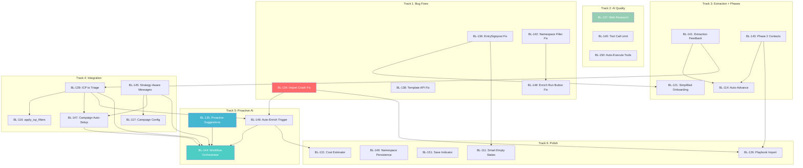

# Sprint 5: Seamless Flow

**Date**: 2026-03-02
**Theme**: From isolated islands to a guided, AI-driven GTM workflow
**Goal**: Push E2E workflow seamlessness from 3.2/10 to 9/10 by connecting every feature into a proactive, orchestrated experience.

---

## Baseline Reference

- **Test report**: `tests/baseline-eval/BASELINE-REPORT.md`
- **Scores**: `tests/baseline-eval/scores.json`
- **Friction analysis**: `tests/baseline-eval/friction-analysis.md`
- **Ideal workflow**: `tests/baseline-eval/ideal-workflow.md`
- **System inventory**: `tests/baseline-eval/system-inventory.md`
- **Test subject**: `tests/baseline-eval/test-subject-profile.md`
- **Target**: Re-run same test (unitedarts.cz, 10 contacts) after sprint and compare against baseline-001.

---

## Sprint Metrics (Before / Target)

| Dimension | Baseline | Target | Delta | Key Items |
|-----------|----------|--------|-------|-----------|
| Overall Completeness | 6.0 | 9.0 | +3.0 | BL-134, BL-136, BL-138, BL-143, BL-148 |
| Workflow Seamlessness | 3.2 | 9.0 | +5.8 | BL-135, BL-144, BL-146, BL-147, BL-114 |
| AI Quality | 7.5 | 9.5 | +2.0 | BL-137, BL-140, BL-150 |
| User Effort | 7.2 | 9.0 | +1.8 | BL-134, BL-140, BL-121, BL-149 |
| Proactiveness | 2.6 | 9.0 | +6.4 | BL-135, BL-144, BL-146, BL-147 |

---

## Overlap Resolution

Items from Sprint 4 and unassigned backlog that overlap with Sprint 5 items:

| Source Item | Decision | Rationale |
|-------------|----------|-----------|
| **BL-113** (Sprint 4): Wire company research into onboarding | **MERGED into BL-137** | BL-137 adds web research to all strategy generation, which is a superset of BL-113's onboarding-only scope. BL-113 will be marked as merged/superseded. |
| **BL-133** (Unassigned): Phase Transition Prompts | **MERGED into BL-135** | Proactive next-step suggestions (BL-135) subsume phase transition prompts. BL-133's CTA buttons become part of BL-135's suggestion chips. |
| **BL-111** (Sprint 4): App-Wide Onboarding Signpost | **MOVED to Sprint 5** | Overlaps BL-136 (entry signpost bug fix). Do BL-136 first (fix), then BL-111 (enhance). |
| **BL-114** (Sprint 4): Auto-advance to Contacts | **MOVED to Sprint 5** | Depends on BL-141 (extraction feedback) + BL-143 (Phase 2 implementation). |
| **BL-116** (Sprint 4): apply_icp_filters chat tool | **MOVED to Sprint 5** | Complementary to BL-139 (ICP to triage). BL-139 is the backend bridge, BL-116 is the chat tool. |
| **BL-117** (Sprint 4): Auto-populate campaign generation_config | **MOVED to Sprint 5** | Subset of BL-145 (strategy-aware messages). |
| **BL-121** (Sprint 4): Simplify onboarding to 2 inputs | **MOVED to Sprint 5** | First-time UX, pairs with BL-136. |
| **BL-126** (Unassigned): Contact Import in Playbook | **MOVED to Sprint 5** | Depends on BL-134 (import fix) + BL-143 (Phase 2). Embeds import in playbook flow. |
| **BL-131** (Unassigned): Credit Cost Estimator | **MOVED to Sprint 5** | Component needed by BL-146 (cost approval gate). Not standalone -- embedded in BL-146. |

---

## Items (22 total)

### Track 1: Bug Fixes (5 items) -- Week 1, Days 1-2

All Track 1 items are independent with no cross-item dependencies. They can run fully in parallel. These must land first because downstream tracks depend on a working import, working enrichment page, and working onboarding.

---

#### BL-134: Fix Import Column Mapping UI Crash [Must Have] [S]

**Problem**: Import wizard crashes on Step 2 (Map Columns) with `TypeError: Cannot read properties of undefined (reading 'length')`. Page goes blank after "Upload & Analyze". Resume also crashes. No user can complete any data import through the UI.

**Solution**: Fix the null-safety issue in `MappingStep.tsx` where `mappingResult.columns` is accessed before the mapping API response returns. Add defensive checks and loading states.

**Acceptance Criteria**:
- Given a user uploads a CSV file on the Import page
- When they click "Upload & Analyze"
- Then the column mapping UI renders with AI-suggested mappings (no crash, no blank page)
- And the "Resume" button on a saved import also renders the mapping step correctly
- And all 7 columns from the test CSV (First Name, Last Name, Organization, Title, Email, Phone, Notes) are mapped with >= 0.95 confidence

**Technical Approach**:
- File: `frontend/src/pages/import/MappingStep.tsx` -- add null checks on `mappingResult?.columns?.length` and `mappingResult?.mappings`
- File: `frontend/src/pages/import/ImportPage.tsx` -- verify the state machine handles the transition from upload to mapping correctly when API response is async
- The backend already works perfectly (0.99 confidence mapping in baseline test). This is purely a frontend state management fix.
- Test: upload `tests/baseline-eval/test-contacts.csv`, verify all 7 columns render in the mapping UI

**Dependencies**: None
**Blocks**: BL-146 (auto-enrichment needs working import), BL-126 (playbook import)
**Baseline Reference**: Step 4 (Contact Import) -- Availability 3/10, User Effort 1/10. Friction A1, A6, G2.
**Score Impact**: Step 4 Availability 3 -> 9 (+6), User Effort 1 -> 8 (+7)

---

#### BL-136: Fix EntrySignpost for Empty Namespaces [Must Have] [S]

**Problem**: `EntrySignpost` component exists in code but does not render for empty namespaces. New users see an empty contacts page with a full filter sidebar (Company Tier, Industry, Size, Region, Revenue, Seniority, Department, LinkedIn Activity). No guidance on what to do first.

**Solution**: Fix the rendering condition in the namespace root page so `EntrySignpost` shows when the namespace has 0 contacts AND no strategy document.

**Acceptance Criteria**:
- Given a namespace has 0 contacts AND no strategy document
- When user navigates to the namespace root (`/:namespace/`)
- Then the EntrySignpost renders with 3 paths: "Build a Strategy", "Import Contacts", "Browse Templates"
- And the full filter sidebar is NOT shown on the empty contacts page
- And clicking each path navigates to the correct page (Playbook, Import, Preferences > Templates)

**Technical Approach**:
- File: `frontend/src/components/onboarding/EntrySignpost.tsx` -- check the rendering condition. It likely checks for `contacts.length === 0` but the API call may not have completed, or the condition checks the wrong state.
- File: The namespace index route or `ContactsPage.tsx` -- the page that should conditionally render EntrySignpost vs the contacts list. Verify the onboarding status API call (`GET /api/tenants/onboarding-status`) is made and its result drives the signpost visibility.
- Backend: `GET /api/tenants/onboarding-status` already returns milestones (strategy_saved, contacts_imported, campaign_created). Frontend needs to use this response.

**Dependencies**: None
**Blocks**: BL-121 (simplified onboarding), BL-111 (enhanced signpost)
**Baseline Reference**: Step 1 (Login + Navigation) -- Proactiveness 2/10. Friction A3, B2, B12.
**Score Impact**: Step 1 Proactiveness 2 -> 7 (+5)

---

#### BL-138: Fix Template Application API [Must Have] [S]

**Problem**: `/api/playbook/apply-template` returns an error when applying a strategy template during PlaybookOnboarding. The system silently falls back to AI chat generation. No error toast shown to user.

**Solution**: Fix the backend endpoint and add error feedback in the frontend.

**Acceptance Criteria**:
- Given user selects a template in PlaybookOnboarding (e.g., "Professional Services -- Local Market")
- When "Personalize" is clicked
- Then the template content is applied to the strategy document with placeholders filled from user inputs
- And the editor shows the populated template content
- And if the API fails, a toast error is shown (not silent failure)

**Technical Approach**:
- File: `api/routes/playbook_routes.py` -- find the `apply-template` route handler, debug the error (likely a missing field in template data or a serialization issue with StrategyDocument JSONB content)
- File: `api/routes/strategy_template_routes.py` -- verify template CRUD works, check if template format matches what `apply-template` expects
- File: `frontend/src/components/playbook/PlaybookOnboarding.tsx` -- add error handling to the template application call, show toast on failure
- File: `frontend/src/components/playbook/TemplateSelector.tsx` -- verify the template ID is passed correctly

**Dependencies**: None
**Blocks**: None (AI chat fallback works, but this restores the fast path)
**Baseline Reference**: Step 2 (Strategy Creation) -- Friction A2, B4. Template failure forced 4 interactions instead of 2.
**Score Impact**: Step 2 User Effort 5 -> 8 (+3)

---

#### BL-142: Fix Cross-Namespace Filter Leakage on Enrich Page [Must Have] [S]

**Problem**: Enrichment page tag filter shows tags from other namespaces (visionvolve's "batch-2-NL-NORDICS[OPS/FIN]" visible in unitedarts namespace). Data isolation breach.

**Solution**: Scope the tag filter API call to the current namespace's `tenant_id`.

**Acceptance Criteria**:
- Given user is in namespace X
- When viewing the Enrich page tag filter dropdown
- Then only tags belonging to namespace X are shown
- And no tags from other namespaces appear

**Technical Approach**:
- File: `frontend/src/pages/enrich/EnrichPage.tsx` or `frontend/src/pages/enrich/useEnrichState.ts` -- find the tag filter data fetch. It likely calls `GET /api/tags` without passing the namespace header, or the backend doesn't filter by tenant_id.
- File: `api/routes/` -- tag listing endpoint. Verify `tenant_id` filtering is applied. The `GET /api/tags` endpoint should filter by the authenticated user's current namespace.
- Check: `X-Namespace` header is being sent on the tag fetch request from the enrich page.

**Dependencies**: None
**Blocks**: BL-148 (enrichment run button may share root cause)
**Baseline Reference**: Step 5 (Basic Enrichment) -- Friction A4, F1. Data isolation issue.
**Score Impact**: Step 5 Availability 7 -> 8 (+1)

---

#### BL-148: Fix Enrichment Run Button Stuck in Loading State [Must Have] [S]

**Problem**: The enrichment page "Run" button shows "Loading..." and never fully loads. Users cannot start enrichment through the UI.

**Solution**: Fix the loading state dependency -- the Run button likely waits for tag/batch data that fails to resolve (possibly related to the cross-namespace filter leakage in BL-142).

**Acceptance Criteria**:
- Given a namespace with imported contacts and selected enrichment stages
- When the user clicks the "Run" button on the Enrich page
- Then the button loads within 2 seconds and shows the run configuration (tag filter, stages, cost estimate)
- And clicking Run triggers the enrichment pipeline

**Technical Approach**:
- File: `frontend/src/pages/enrich/DagControls.tsx` -- find the Run button component and its loading state condition
- File: `frontend/src/pages/enrich/useEnrichState.ts` -- check what data loading blocks the Run button (likely `tags` or `tagStats` or `estimateData`)
- File: `frontend/src/pages/enrich/useEnrichEstimate.ts` -- check if the cost estimate API call fails or hangs
- The loading state may depend on the tag list resolving. If BL-142 fixes the tag fetch, this may also be fixed. Test after BL-142 first.

**Dependencies**: BL-142 (may share root cause with tag filter leakage)
**Blocks**: None
**Baseline Reference**: Step 5 -- Friction A7, G5. Run button non-functional.
**Score Impact**: Step 5 Availability 7 -> 9 (+2)

---

### Track 2: AI Quality (3 items) -- Week 1, Days 2-3

Track 2 items are mostly independent of each other and can run in parallel. They focus on making the AI smarter and more autonomous during strategy generation.

---

#### BL-137: Add Web Research to Strategy Generation [Must Have] [M]

*Absorbs BL-113 (wire company research into onboarding).*

**Problem**: AI generates strategy from training data only. No `web_search` called despite the tool being available. Result: placeholder text like "[X] agencies", no real company details, no Czech competitor names, no mention of specific unitedarts.cz acts (Losers Cirque Company, DaeMen) or venue (Divadlo BRAVO!). Baseline AI Quality accuracy: 6/10, specificity: 6/10.

**Solution**: Update the strategy generation system prompt to REQUIRE web research before writing. The AI must call `web_search` to research the company's website, competitors, and market before generating any strategy sections. Add a research-first instruction sequence.

**Acceptance Criteria**:
- Given user provides a company domain (e.g., unitedarts.cz) in PlaybookOnboarding
- When the AI begins strategy generation
- Then the AI calls `web_search` at least once to research the company website
- And the generated strategy contains real company details (actual acts, venue names, reference clients from the website)
- And no placeholder text like "[X]" or "[Y]%" appears in the output
- And competitive analysis names real competitors (not generic categories)
- And the strategy references information that could only come from researching the company

**Technical Approach**:
- File: `api/services/playbook_service.py` -- update the system prompt to include explicit instructions: "BEFORE writing any strategy section, you MUST call web_search to research the user's company website. Use the domain they provided. Include real details from the website in every section."
- File: `api/services/search_tools.py` -- verify `web_search` tool is registered and works. Check the Perplexity sonar integration returns useful results for Czech domains.
- File: `api/services/agent_executor.py` -- the `TOOL_RATE_LIMITS` for `web_search` is 3 per turn (line 31). Consider increasing to 5 for strategy generation (research company + competitors + market + industry + local context).
- Prompt strategy: Add a "research phase" instruction: "Step 1: Research [domain] via web_search. Step 2: Research competitors in [market]. Step 3: Write strategy sections using your research findings."
- Test with unitedarts.cz: output must mention Losers Cirque Company, DaeMen, Divadlo BRAVO!, and at least 2 real Czech competitors.

**Dependencies**: None
**Blocks**: None
**Baseline Reference**: Step 2 -- AI Quality 7/10 (accuracy 6, specificity 6). Friction C1, C10-C12, E1-E4.
**Score Impact**: AI Quality 7 -> 9 (+2). Step 2 accuracy 6 -> 9, specificity 6 -> 9.

---

#### BL-140: Increase Agent Tool Call Limit or Auto-Continue [Must Have] [S]

**Problem**: Agent has `DEFAULT_TOOL_RATE_LIMIT = 5` per tool per turn (`agent_executor.py` line 33). Writing a 9-section strategy requires 9 `update_strategy_section` calls, but only 5 are allowed per turn. Forces the user to re-prompt for the remaining 4 sections. `MAX_TOOL_ITERATIONS = 10` (line 27) is sufficient total iterations, but the per-tool rate limit of 5 is the bottleneck.

**Solution**: Increase `DEFAULT_TOOL_RATE_LIMIT` to 15 and `MAX_TOOL_ITERATIONS` to 20. This allows the AI to complete a full strategy (9 sections + 2-3 web searches + extraction) in a single turn.

**Acceptance Criteria**:
- Given user asks AI to write a complete 9-section strategy document
- When the AI generates all sections using `update_strategy_section` tool
- Then all 9 sections are written in a single user turn (no re-prompt needed)
- And the rate limit is not visible to the user in any form
- And web_search calls are not blocked by the increased limit

**Technical Approach**:
- File: `api/services/agent_executor.py` line 27: change `MAX_TOOL_ITERATIONS = 10` to `MAX_TOOL_ITERATIONS = 20`
- File: `api/services/agent_executor.py` line 33: change `DEFAULT_TOOL_RATE_LIMIT = 5` to `DEFAULT_TOOL_RATE_LIMIT = 15`
- Keep `web_search` rate limit at 3 per turn (to control Perplexity costs) -- line 31
- Safety: add a cost circuit breaker -- if total LLM cost for a single turn exceeds a threshold (e.g., 500 credits), pause and ask user to confirm before continuing
- Test: strategy generation for unitedarts.cz should complete in 1 user message (describe business) + 1 approval

**Dependencies**: None
**Blocks**: None
**Baseline Reference**: Step 2 -- Friction A5, E6. User forced into 3 turns instead of 1.
**Score Impact**: Step 2 User Effort 5 -> 9 (+4)

---

#### BL-150: AI Agent Should Auto-Execute Tools After Onboarding [Should Have] [M]

**Problem**: After PlaybookOnboarding wizard completes and falls back to AI chat, the AI responds with "I'll build your strategy" but does NOT execute any tools. User must send a second explicit prompt to trigger tool execution.

**Solution**: Ensure the auto-generated chat message from onboarding includes a strong instruction for immediate action, and modify the agent executor to treat auto-generated messages the same as user messages.

**Acceptance Criteria**:
- Given user completes the PlaybookOnboarding wizard (Discovery + Template steps)
- When the AI receives the auto-generated chat message with user inputs
- Then the AI immediately begins executing strategy tools (web_search + update_strategy_section) without waiting for another user prompt
- And the AI does NOT send a text-only "I'll do this" response without acting

**Technical Approach**:
- File: `frontend/src/components/playbook/PlaybookOnboarding.tsx` -- check the auto-generated message sent to chat after onboarding. It may be too vague ("Build my strategy") -- make it explicit: "Research [domain] and write a complete GTM strategy document for [company description]. Execute all tools immediately."
- File: `api/services/playbook_service.py` -- add to system prompt: "When you receive the initial strategy request, DO NOT describe what you will do. Immediately call web_search and start writing sections. Action first, summary after."
- File: `api/services/agent_executor.py` -- verify that auto-generated messages (those with a special flag or marker) are processed identically to user messages in the tool-use loop
- Test: onboarding with unitedarts.cz should result in immediate tool calls (no "I'll build your strategy" text-only response)

**Dependencies**: None
**Blocks**: None
**Baseline Reference**: Step 2 -- Friction B5, E5. Extra prompt wasted on re-triggering.
**Score Impact**: Step 2 User Effort 5 -> 8 (+3 combined with BL-140)

---

### Track 3: Extraction + Phase Transitions (4 items) -- Week 1, Days 3-5

Track 3 builds the bridge from Strategy (Phase 1) through Extraction to Contacts (Phase 2). Items are partially sequential: BL-141 and BL-143 can start in parallel, but BL-114 depends on both. BL-121 depends on BL-136 from Track 1.

---

#### BL-141: Add ICP Extraction Feedback and Confirmation [Must Have] [S]

**Problem**: ICP extraction runs silently. "Extract ICP" button shows "Extracting..." for 5-10 seconds then returns to default state. No toast, no summary, no confirmation of what was extracted. User has no idea what was extracted or whether it succeeded.

**Solution**: After extraction, show a confirmation dialog/panel summarizing what was extracted. Toast notification on success/failure.

**Acceptance Criteria**:
- Given user clicks "Extract ICP" on the Playbook page
- When extraction completes successfully
- Then a confirmation panel/dialog appears showing extracted ICP data: target industries, geography, company size range, job titles, qualification signals
- And a toast notification confirms "ICP criteria extracted successfully"
- And if extraction fails or extracts empty data, an error toast is shown with guidance
- And a progress indicator (spinner or progress bar) is visible during the 5-10 second extraction

**Technical Approach**:
- File: `frontend/src/pages/playbook/PlaybookPage.tsx` -- find the "Extract ICP" button handler. It calls `POST /api/playbook/extract`. After success, show a modal/panel with the `extracted_data.icp` contents.
- File: `api/routes/playbook_routes.py` -- verify the extract endpoint returns the extracted data in the response body (not just a 200 OK)
- New component or inline panel in PlaybookPage that renders the extracted ICP fields in a readable format:
  - Industries: [list]
  - Geography: [list]
  - Company size: [range]
  - Job titles: [list]
  - Qualification signals: [list]
- Add a loading spinner while extraction is running
- Add toast via the existing toast/notification system

**Dependencies**: None
**Blocks**: BL-114 (auto-advance needs extraction feedback), BL-139 (ICP-to-triage bridge)
**Baseline Reference**: Step 3 (Intelligence Extraction) -- Seamlessness 3/10. Friction B1, H1.
**Score Impact**: Step 3 Seamlessness 3 -> 7 (+4), Availability 5 -> 8 (+3)

---

#### BL-143: Implement Playbook Phase 2 -- Contacts Selection [Must Have] [L]

**Problem**: Playbook Phase 2 shows "Coming soon. Use the chat to discuss this phase with your AI strategist." The "Select Contacts" button is disabled. This is a dead end that breaks the playbook flow between Strategy and Messages.

**Solution**: Phase 2 shows ICP-matched contacts from the namespace. Users can view contacts matched against ICP criteria, confirm a selection, and proceed to Messages phase.

**Acceptance Criteria**:
- Given user navigates to Playbook Phase 2 (Contacts)
- When ICP criteria have been extracted (extracted_data.icp is populated)
- Then the panel shows contacts matched against ICP criteria with match counts
- And users can select/deselect contacts for the campaign
- And a "Confirm Selection" button advances to Phase 3 (Messages)
- And the "Select Contacts" button is enabled (not disabled)
- And if no ICP criteria exist, a message guides the user to extract ICP first (with a button)

**Technical Approach**:
- File: `frontend/src/components/playbook/ContactsPhasePanel.tsx` -- this component already exists. Replace the "Coming soon" placeholder with a contacts list view.
- Backend: `GET /api/playbook/contacts` already exists and returns ICP-matching contacts. `POST /api/playbook/contacts/confirm` already exists for confirming selection.
- The ContactsPhasePanel should:
  1. Call `GET /api/playbook/contacts` to get matched contacts with ICP score
  2. Display contacts in a selectable list (checkbox per contact) with company, title, email, match score
  3. Show filter summary: "X contacts match your ICP criteria (industries: [list], geo: [list])"
  4. "Confirm Selection" button calls `POST /api/playbook/contacts/confirm` and advances phase
- File: `frontend/src/components/playbook/PhasePanel.tsx` -- update to render ContactsPhasePanel for phase 2

**Dependencies**: None (backend API already exists)
**Blocks**: BL-114 (auto-advance targets this phase), BL-126 (playbook import)
**Baseline Reference**: Step 3 -- Friction B3, B15, C2, D1, G1. "Coming soon" dead end.
**Score Impact**: Step 3 Availability 5 -> 8 (+3)

---

#### BL-114: Auto-Advance to Contacts Phase After ICP Extraction [Must Have] [S]

*Moved from Sprint 4.*

**Problem**: After ICP extraction succeeds, the user must manually navigate to Phase 2 (Contacts). No automatic advancement or suggestion.

**Solution**: After extraction, automatically advance the playbook phase from Strategy to Contacts and navigate the URL.

**Acceptance Criteria**:
- Given user clicks "Extract ICP" and extraction succeeds
- When the ICP confirmation dialog is shown (from BL-141)
- Then after user confirms/dismisses the dialog, the playbook auto-advances to Phase 2 (Contacts)
- And the URL updates to `/:namespace/playbook/contacts`
- And the PhaseIndicator highlights the Contacts phase

**Technical Approach**:
- File: `frontend/src/pages/playbook/PlaybookPage.tsx` -- after extraction success (and after the BL-141 confirmation dialog is dismissed), call `PUT /api/playbook/phase` with `{phase: "contacts"}` via the existing `useAdvancePhase` hook
- File: `api/routes/playbook_routes.py` -- the backend phase gate already validates that `extracted_data.icp` must be non-empty before allowing strategy -> contacts transition (see `_validate_phase_transition`)
- Frontend uses `useNavigate()` to update the URL to the contacts phase

**Dependencies**: BL-141 (extraction feedback), BL-143 (Phase 2 must exist to advance to it)
**Blocks**: None
**Baseline Reference**: Step 3 -- Friction G1. Dead end after extraction.
**Score Impact**: Step 3 Seamlessness 3 -> 8 (+5)

---

#### BL-121: Simplify Onboarding to 2 Inputs [Should Have] [S]

*Moved from Sprint 4.*

**Problem**: PlaybookOnboarding wizard has a multi-step flow (Discovery form with 3 fields + Template selection step). The AI should pick the right template automatically. Users should describe their business and challenge, and get a strategy immediately.

**Solution**: Reduce onboarding to a single-step form: business description + challenge type. The AI selects the format and generates immediately on submit.

**Acceptance Criteria**:
- Given user opens Playbook for first time (no strategy exists)
- When the onboarding wizard appears
- Then it shows 2 fields: (1) textarea for business description (pre-filled hint: "Describe your business..."), (2) dropdown for challenge type (Lead Generation, Market Entry, Product Launch, Account Expansion, Event Promotion)
- And the company domain is pre-filled from the namespace settings (if available)
- And clicking "Generate My Strategy" immediately starts research + generation (no template selection step)
- And the AI auto-selects the appropriate template/format based on the challenge type

**Technical Approach**:
- File: `frontend/src/components/playbook/PlaybookOnboarding.tsx` -- simplify from multi-step wizard to single form
- Remove: the TemplateSelector step (AI decides the format)
- Auto-inject: domain from namespace settings (via tenant API)
- The auto-generated chat message on submit should be: "I run [description]. My main challenge is [challenge type]. My website is [domain]. Research my company and build a complete GTM strategy document. Execute all tools immediately."
- This pairs with BL-150 (auto-execute) to ensure the AI acts immediately

**Dependencies**: BL-136 (EntrySignpost fix -- onboarding appears correctly for new namespaces)
**Blocks**: None
**Baseline Reference**: Step 2 -- Friction B12. Multi-step wizard adds friction.
**Score Impact**: Step 2 User Effort 5 -> 9 (+4 combined with BL-140, BL-150)

---

### Track 4: Cross-Feature Integration (5 items) -- Week 1 Day 5 through Week 2 Day 3

Track 4 builds the bridges between features. Items are partially sequential: BL-139 -> BL-116, BL-145 -> BL-117, and BL-147 depends on both BL-139 and BL-145.

---

#### BL-139: Connect ICP Extraction to Enrichment Triage Rules [Must Have] [M]

**Problem**: ICP criteria extracted from the strategy are not used by the enrichment triage evaluator. Triage rules must be configured manually. The strategy -> enrichment pipeline is broken.

**Solution**: After ICP extraction, auto-populate enrichment triage rules with: target industries, company size range, geography, job title filters. The triage evaluator reads these rules when qualifying companies.

**Acceptance Criteria**:
- Given ICP criteria have been extracted (extracted_data.icp populated)
- When the enrichment triage evaluator runs on a company
- Then it uses the ICP criteria as qualification rules: industry match, geography match, company size within range
- And companies matching ICP criteria are marked "Triage: Passed"
- And companies not matching are marked "Triage: Review" or "Disqualified" with reasons
- And manual override is still possible (user can adjust rules)

**Technical Approach**:
- File: `api/services/triage_evaluator.py` -- modify the triage evaluation to read ICP criteria from the namespace's StrategyDocument. Currently triage uses hardcoded or manually configured rules. Add an ICP-aware mode:
  1. Load `StrategyDocument.extracted_data.icp` for the tenant
  2. Map ICP fields to triage rules: `icp.industries` -> industry allowlist, `icp.geographies` -> geo allowlist, `icp.company_size` -> min/max employee thresholds
  3. Evaluate companies against these rules
- File: `api/models.py` -- verify `StrategyDocument` model has `extracted_data` JSONB with the ICP structure
- File: `api/services/dag_executor.py` -- ensure the triage stage passes the tenant_id so it can load the right strategy
- Fallback: if no ICP criteria exist, use the existing manual rules (backward compatible)

**Dependencies**: BL-141 (extraction feedback confirms ICP is extracted)
**Blocks**: BL-116 (apply_icp_filters tool), BL-146 (auto-enrichment), BL-147 (campaign auto-setup), BL-144 (orchestrator)
**Baseline Reference**: Friction C5, C13, D3. Strategy and enrichment are disconnected.
**Score Impact**: Step 6 Seamlessness 3 -> 7 (+4)

---

#### BL-116: apply_icp_filters Chat Tool -- Bridge Strategy to Contacts [Must Have] [S]

*Moved from Sprint 4.*

**Problem**: No chat tool exists to apply ICP filters to the contacts list. The AI cannot help users find ICP-matching contacts through conversation.

**Solution**: New AI chat tool (`apply_icp_filters`) that reads ICP criteria from the strategy and maps them to contact filter parameters with match counts.

**Acceptance Criteria**:
- Given user asks the AI "Show me contacts matching my ICP" in chat
- When the AI calls the `apply_icp_filters` tool
- Then the tool reads `extracted_data.icp` from the StrategyDocument
- And maps ICP fields to contact filters: industries -> industry, company_size -> company_size, geographies -> geo_region, personas.seniority -> seniority_level
- And returns match counts and top segment breakdown
- And the AI presents results: "42 contacts match your ICP: 28 in event management, 14 in marketing agencies"

**Technical Approach**:
- File: `api/services/icp_filter_tools.py` -- this file already exists with the `apply_icp_filters` function. Verify it reads from StrategyDocument correctly and integrates with BL-139's ICP-to-triage mapping.
- File: `api/services/tool_registry.py` or wherever tools are registered -- verify `apply_icp_filters` is registered and available to the agent
- The tool should reuse `filter_contacts` logic from `campaign_tools.py` to query contacts matching the ICP criteria
- Return: `{ matched_count: N, segments: [{industry: "event management", count: 28}, ...], sample_contacts: [...] }`

**Dependencies**: BL-139 (ICP to triage mapping provides the mapping logic)
**Blocks**: None
**Baseline Reference**: Friction C5, D1. Strategy criteria not usable by contacts.
**Score Impact**: Proactiveness indirect improvement (AI can proactively filter contacts)

---

#### BL-145: Strategy-Aware Message Generation [Must Have] [M]

**Problem**: Message generation (Claude Haiku) may not use the GTM strategy context (messaging angles, value props, tone guidelines, competitive positioning) when generating outreach messages. The generation prompt needs strategy enrichment.

**Solution**: Include strategy document sections in the message generation prompt: messaging framework, value proposition, competitive positioning, and ICP criteria.

**Acceptance Criteria**:
- Given a campaign with contacts and a strategy document
- When messages are generated via Claude Haiku
- Then each message's prompt includes: the messaging framework section, value proposition, competitive positioning, and ICP buyer persona matching the contact's role
- And generated messages reference strategy-specific talking points (not generic outreach)
- And tone matches the strategy's messaging framework guidelines

**Technical Approach**:
- File: `api/services/generation_prompts.py` -- update the `build_generation_prompt()` function to include strategy context. Add parameters for strategy_document content (or load it from the campaign's `strategy_id` FK).
- File: `api/services/message_generator.py` -- pass strategy context into the prompt builder. The Campaign model already has `strategy_id` (FK to StrategyDocument). Load the strategy and pass relevant sections.
- Strategy sections to include in prompt: `messaging_framework`, `value_proposition`, `competitive_positioning`, `buyer_personas` (select the persona matching the contact's seniority/role)
- File: `api/models.py` -- verify Campaign has `strategy_id` column and it's populated during campaign creation
- Test: generate messages for unitedarts.cz contacts -- messages should reference entertainment/circus industry specifics from the strategy, not generic B2B outreach

**Dependencies**: None
**Blocks**: BL-117 (campaign config), BL-147 (campaign auto-setup), BL-144 (orchestrator)
**Baseline Reference**: Step 9 (Message Generation) -- untested but critical for 9/10. Friction C9.
**Score Impact**: Step 9 AI Quality null -> 9

---

#### BL-117: Auto-Populate Campaign generation_config from Linked Strategy [Must Have] [S]

*Moved from Sprint 4.*

**Problem**: When creating a campaign, the generation_config (tone, channel preferences, template steps) is not auto-populated from the linked strategy. Users must manually configure settings that the strategy already defines.

**Solution**: When a campaign is created with a `strategy_id`, auto-populate campaign fields from the strategy's `extracted_data`.

**Acceptance Criteria**:
- Given a campaign is created via the `create_campaign` chat tool or `POST /api/campaigns` with a `strategy_id`
- When the strategy has extracted_data with messaging framework and channel strategy
- Then `generation_config.tone` is set from `extracted_data.messaging.tone`
- And `target_criteria` is set from `extracted_data.icp` (industries, company_size, geographies)
- And `channel` is set from `extracted_data.channel_strategy` (primary channel)
- And the user can override any auto-populated field

**Technical Approach**:
- File: `api/services/campaign_tools.py` -- update the `create_campaign` tool to load StrategyDocument when `strategy_id` is provided, and populate `generation_config` and `target_criteria` from `extracted_data`
- File: `api/routes/campaign_routes.py` -- update `POST /api/campaigns` to do the same auto-population when `strategy_id` is in the request body
- Mapping: `extracted_data.icp` -> `target_criteria`, `extracted_data.messaging.tone` -> `generation_config.tone`, `extracted_data.channel_strategy` primary -> `channel`

**Dependencies**: BL-145 (strategy-aware generation provides the strategy context pipeline)
**Blocks**: None
**Baseline Reference**: Friction C9. Campaign has no strategy awareness.
**Score Impact**: Step 8 Seamlessness 3 -> 7 (+4)

---

#### BL-147: Campaign Auto-Setup from Qualified Contacts [Must Have] [M]

**Problem**: After enrichment and triage, user must manually create a campaign, assign contacts, and configure settings. No automation bridge from enrichment to campaign.

**Solution**: After triage review, system auto-creates a draft campaign with qualified contacts pre-assigned and strategy-derived settings.

**Acceptance Criteria**:
- Given enrichment + triage has been run and companies are marked "Triage: Passed"
- When the user (or orchestrator) triggers campaign creation
- Then a draft campaign is auto-created with: qualified contacts pre-assigned, strategy-derived name (e.g., "Czech Event Agencies - Q1 2026"), generation_config from strategy, channel from strategy
- And the AI presents the draft in chat: "I've created a campaign with X qualified contacts. Settings: [channel], [tone]. Ready to generate messages?"
- And the user can approve to proceed or modify settings first

**Technical Approach**:
- File: `api/services/campaign_tools.py` -- add a new function `auto_create_campaign_from_triage()` that:
  1. Queries companies with status "Triage: Passed" for the tenant
  2. Gets their associated contacts
  3. Creates a Campaign with `strategy_id` (auto-populates via BL-117)
  4. Adds contacts to the campaign via `CampaignContact` records
  5. Returns the campaign summary
- File: `api/services/tool_registry.py` -- register the new tool for the chat agent
- The chat agent uses this tool when suggesting campaign creation after enrichment
- The campaign is created in "draft" status -- user must approve before message generation

**Dependencies**: BL-139 (ICP-to-triage for qualified contacts), BL-145 (strategy-aware config for the campaign)
**Blocks**: BL-144 (orchestrator uses this as the enrichment -> campaign bridge)
**Baseline Reference**: Steps 8-9 Seamlessness 3/10. Friction C15, D4.
**Score Impact**: Steps 8-9 Seamlessness 3 -> 8 (+5)

---

### Track 5: Proactive AI + Orchestration (3 items) -- Week 2, Days 1-5

Track 5 is the capstone track. BL-135 (proactive suggestions) can start early (no hard dependencies on Track 4). BL-146 depends on Track 1 (BL-134) + Track 4 (BL-139). BL-144 (orchestrator) depends on everything and is the final item.

---

#### BL-135: Proactive Next-Step Suggestions in Chat [Must Have] [L]

*Absorbs BL-133 (phase transition prompts).*

**Problem**: After each major action, the system waits passively. The AI never suggests what to do next. Baseline proactiveness: 2.6/10. The chat sidebar never proactively offered guidance at any point during the entire baseline test.

**Solution**: After each major action (strategy saved, ICP extracted, contacts imported, enrichment completed, triage done, messages generated, messages reviewed), the chat sidebar proactively suggests the next logical step with a 1-click action button.

**Acceptance Criteria**:
- Given user has just completed a strategy document
- When the strategy is saved
- Then the chat proactively says: "Your GTM strategy is complete. I've identified your ICP criteria. Shall I extract them now?" with an "Extract ICP" action button
- And after ICP extraction: "ICP criteria extracted: [summary]. Ready to find matching contacts?" with "View Contacts" button
- And after contact import: "10 contacts imported. I can run enrichment to research these companies. Estimated cost: ~200 credits. Shall I start?" with "Run Enrichment" button
- And after enrichment: "Enrichment complete. 7 companies passed qualification. Ready to create a campaign?" with "Create Campaign" button
- And after campaign creation: "Campaign ready with 8 contacts. Shall I generate personalized messages?" with "Generate Messages" button
- And after message generation: "16 messages generated. Open the review queue?" with "Review Messages" button
- And after message review: "All messages approved. Ready to launch outreach?" with "Send Campaign" button

**Technical Approach**:
- File: `frontend/src/components/chat/ChatProvider.tsx` -- add a `nextStepSuggestion` state that tracks the current workflow position and generates appropriate suggestions
- New function: `computeNextStep(currentState)` that takes the namespace's workflow state (has_strategy, has_icp, has_contacts, has_enrichment, has_campaign, has_messages, has_reviewed) and returns the appropriate suggestion
- File: `frontend/src/components/chat/ChatMessages.tsx` -- render suggestion chips/buttons as special message types at the bottom of the chat
- Backend: add a `GET /api/workflow/status` endpoint that returns the current workflow state for the namespace:
  ```json
  {
    "strategy_exists": true,
    "icp_extracted": true,
    "contacts_imported": true,
    "contacts_count": 10,
    "enrichment_complete": false,
    "triage_complete": false,
    "campaign_exists": false,
    "messages_generated": false,
    "messages_reviewed": false
  }
  ```
- File: `api/routes/playbook_routes.py` or new `api/routes/workflow_routes.py` -- implement the workflow status endpoint by querying existing models
- The ChatProvider polls or subscribes to workflow status changes and updates suggestions accordingly
- Action buttons in suggestions call the appropriate API endpoints (extract ICP, navigate to enrich page, trigger enrichment, create campaign, etc.)
- File: `frontend/src/components/chat/ChatPanel.tsx` -- ensure suggestions render on all pages (not just Playbook)

**Dependencies**: None (can start early, refines as other items land)
**Blocks**: BL-144 (orchestrator builds on this suggestion engine)
**Baseline Reference**: All steps -- Proactiveness 2-5/10 across all tested steps. Friction B7-B11, C4, C7, C8, G3, G4.
**Score Impact**: Proactiveness 2.6 -> 8 (+5.4). Single highest-impact item.

---

#### BL-146: Auto-Enrichment Trigger with Cost Approval Gate [Must Have] [M]

*BL-131 (Credit Cost Estimator) is embedded in this item's scope.*

**Problem**: After importing contacts, user must manually navigate to the Enrich page, configure filters, and click Run. No cost estimate shown proactively. No bridge from import to enrichment.

**Solution**: After contact import, the system automatically calculates an enrichment cost estimate and presents it in the chat with a 1-click approval. The cost estimator component (BL-131 scope) is built as part of this approval gate.

**Acceptance Criteria**:
- Given contacts have been imported (import job completed)
- When the import success handler fires
- Then the chat proactively says: "10 contacts imported across 8 companies. I recommend running L1 enrichment. Cost estimate: ~160 credits (8 companies x 20 credits). Your balance: 5000 credits. Shall I start?"
- And shows a cost breakdown: L1 company count, per-company cost, total, remaining balance
- And an "Approve & Start" button triggers enrichment
- And a "Customize" link navigates to the Enrich page for manual configuration
- And if balance is insufficient, shows a warning instead of the approve button

**Technical Approach**:
- File: `api/routes/import_routes.py` -- after a successful import execution, return enrichment eligibility info in the response (company count, estimated cost)
- File: `frontend/src/pages/import/ImportSuccess.tsx` -- after import success, trigger a chat suggestion via ChatProvider
- File: `frontend/src/components/chat/ChatProvider.tsx` -- add an `onImportComplete` handler that generates the enrichment suggestion with cost breakdown
- Backend: use existing `POST /api/enrich/estimate` to calculate the cost. New wrapper that takes company IDs and returns the L1 estimate.
- File: `api/services/budget.py` -- use existing budget check logic to validate sufficient credits
- The "Approve & Start" button calls `POST /api/pipeline/dag-run` with the imported companies' tag
- Cost estimator UI: render cost breakdown inline in the chat message (not a separate component)

**Dependencies**: BL-134 (import must work to trigger), BL-139 (ICP criteria feed triage post-enrichment)
**Blocks**: BL-144 (orchestrator uses this as import -> enrichment bridge)
**Baseline Reference**: Step 5 -- Proactiveness 2/10. Friction B14, D2.
**Score Impact**: Step 5 Proactiveness 2 -> 8 (+6), Seamlessness 3 -> 8 (+5)

---

#### BL-144: End-to-End Workflow Orchestrator (Strategy to Campaign) [Must Have] [XL]

**Problem**: Each feature is an isolated island. There is no orchestration layer connecting strategy -> import -> enrich -> qualify -> campaign -> messages -> review -> launch. Baseline seamlessness: 3.2/10. This is the biggest gap vs. the product vision.

**Solution**: Build a workflow state machine that tracks where the user is in the 10-step GTM workflow and ensures smooth transitions between every step. The orchestrator coordinates the proactive suggestions (BL-135), auto-enrichment (BL-146), auto-campaign (BL-147), and strategy awareness (BL-145) into a unified experience.

**Acceptance Criteria**:
- Given a user starts from an empty namespace
- When they follow the complete workflow (strategy -> extraction -> import -> enrichment -> triage -> campaign -> messages -> review -> send)
- Then each transition is proactively guided (via BL-135 suggestions)
- And enrichment auto-triggers with cost approval (via BL-146)
- And campaign auto-creates from qualified contacts (via BL-147)
- And messages use strategy context (via BL-145)
- And the workflow state is tracked and resumable (user can leave and come back)
- And the workflow status is visible in the UI (progress indicator or checklist)
- And total user interactions for the full workflow is <= 12 (excluding message review)

**Technical Approach**:
- New file: `api/services/workflow_orchestrator.py` -- workflow state machine with states: `empty`, `strategy_created`, `icp_extracted`, `contacts_imported`, `enrichment_running`, `enrichment_complete`, `triage_complete`, `campaign_created`, `messages_generated`, `messages_reviewed`, `outreach_sent`
- State transitions are event-driven: each major action (strategy save, extraction, import, enrichment complete, etc.) triggers a state transition
- New model or tenant setting: `WorkflowState` stored per namespace (current_step, last_action_at, completed_steps[])
- File: `api/routes/workflow_routes.py` -- new endpoints:
  - `GET /api/workflow/status` -- returns current workflow state + next suggested action
  - `POST /api/workflow/advance` -- manually advance workflow state (for testing/override)
- The orchestrator does NOT auto-execute actions -- it only suggests and tracks. The user always approves via the chat suggestions (BL-135).
- Frontend: `WorkflowProgressBar` component showing the 10 steps with current position, displayed in the app shell or namespace header
- File: `frontend/src/components/layout/AppShell.tsx` -- add the workflow progress bar below the navigation
- The progress bar integrates with the ProgressChecklist from onboarding (replace or extend)
- Integration with existing components:
  - BL-135's `computeNextStep()` reads from the orchestrator's workflow state
  - BL-146's import-to-enrichment trigger updates the workflow state
  - BL-147's campaign auto-setup updates the workflow state

**Dependencies**: BL-135 (proactive suggestions), BL-139 (ICP-to-triage), BL-145 (strategy-aware messages), BL-146 (auto-enrichment), BL-147 (campaign auto-setup)
**Blocks**: None (this is the capstone)
**Baseline Reference**: All steps -- Seamlessness 3.2/10 average. Friction C3, C6, D5.
**Score Impact**: Workflow Seamlessness 3.2 -> 9.0 (+5.8). This is the transformation item.

---

### Track 6: Polish + Deferred (5 items) -- Week 2, Days 4-5

Track 6 items are independent and can run in parallel. They polish the experience but are not on the critical path.

---

#### BL-111: App-Wide Onboarding Signpost + Smart Empty States [Should Have] [M]

*Moved from Sprint 4.*

**Problem**: Beyond the EntrySignpost fix (BL-136), the full onboarding system needs smart empty states on every page -- Campaigns page shows a call to action when no campaigns exist, Enrich page guides when no enrichment has been run, etc.

**Solution**: Three-part onboarding system: (1) Entry Signpost (fixed by BL-136), (2) Progress Checklist (lightweight widget showing milestones), (3) Smart Empty States per page.

**Acceptance Criteria**:
- Given a namespace with no campaigns
- When user navigates to the Campaigns page
- Then a `SmartEmptyState` renders: "No campaigns yet. Create your first campaign from the Playbook or import contacts first." with action buttons
- And similar smart empty states appear on: Enrich page (no enrichment run), Messages page (no messages), Contacts page (no contacts, with "Import" button)
- And the ProgressChecklist widget shows in the sidebar: milestones for strategy saved, contacts imported, campaign created (auto-completing as user progresses)

**Technical Approach**:
- File: `frontend/src/components/onboarding/SmartEmptyState.tsx` -- already exists. Create page-specific variants: `CampaignsEmptyState`, `EnrichEmptyState`, `MessagesEmptyState`
- File: `frontend/src/components/onboarding/ProgressChecklist.tsx` -- already exists. Wire to the onboarding status API (`GET /api/tenants/onboarding-status`)
- Pages to update: CampaignsPage, EnrichPage, MessagesPage, ContactsPage -- add conditional rendering of SmartEmptyState when data list is empty
- Keep existing components, just ensure they render correctly and have meaningful CTAs

**Dependencies**: BL-136 (entry signpost fix is the foundation)
**Blocks**: None
**Baseline Reference**: Step 1 -- Friction B2. Overwhelming empty pages.
**Score Impact**: Step 1 Proactiveness 2 -> 8 (+6 combined with BL-136)

---

#### BL-149: Namespace Session Persistence -- Remember Last Used [Should Have] [S]

**Problem**: On fresh page loads, namespace defaults to visionvolve instead of remembering the last-used namespace. Extra click to switch on every session.

**Solution**: Store `lastNamespace` in localStorage. Read on app init before the first API call.

**Acceptance Criteria**:
- Given user last worked in the "unitedarts" namespace
- When they open the app in a new tab or refresh the page
- Then the app loads into the "unitedarts" namespace automatically
- And if the stored namespace is no longer accessible (deleted or role removed), fall back to the first available namespace
- And the namespace dropdown shows the correct active namespace

**Technical Approach**:
- File: `frontend/src/` -- find the namespace resolution logic (likely in the router or a namespace context provider)
- On namespace switch: `localStorage.setItem('lastNamespace', namespaceSlug)`
- On app init: `const savedNamespace = localStorage.getItem('lastNamespace')` -- if valid, use it; otherwise fall back
- Validate the saved namespace against the user's available namespaces (from `GET /api/tenants`)
- Pure frontend change, no backend modifications needed

**Dependencies**: None
**Blocks**: None
**Baseline Reference**: Step 1 -- Friction A8, B13, F2. Extra click on every session.
**Score Impact**: Step 1 User Effort 7 -> 9 (+2)

---

#### BL-151: Strategy Save Progress Indicator Per Section [Could Have] [S]

**Problem**: When the AI writes strategy sections via tools, there is no visual feedback that each section was saved. The user sees tool call indicators but no save confirmation per section.

**Solution**: Show a brief toast or inline indicator confirming "Section X saved" after each `update_strategy_section` tool call.

**Acceptance Criteria**:
- Given the AI is writing strategy sections via `update_strategy_section` tool
- When each section is successfully saved
- Then a brief toast or inline indicator confirms "Section [name] saved"
- And the editor scrolls to show the newly written section

**Technical Approach**:
- File: `frontend/src/components/playbook/ToolCallCard.tsx` -- when a `tool_result` SSE event arrives for `update_strategy_section`, show a brief toast with the section name
- File: `frontend/src/components/playbook/StrategyEditor.tsx` -- after the editor content refreshes (from the tool result), scroll to the newly written section
- Use the existing toast/notification system in the app

**Dependencies**: None
**Blocks**: None
**Baseline Reference**: Step 2 -- Friction B6. No save feedback during generation.
**Score Impact**: Step 2 minimal (UX polish)

---

#### BL-126: Contact Import in Playbook -- Embedded Import Flow [Must Have] [M]

*Moved from Unassigned.*

**Problem**: Import is a standalone page (`/:namespace/import`). Users must leave the Playbook to import contacts, breaking the flow. Phase 2 (Contacts) should allow importing without leaving the playbook context.

**Solution**: Embed the existing import flow (CSV upload wizard) inside the Playbook contacts phase panel as a modal or inline panel.

**Acceptance Criteria**:
- Given user is on Playbook Phase 2 (Contacts)
- When they click "Import Contacts" (or a similar CTA)
- Then a modal or inline panel opens with the import wizard (Upload, Map Columns, Preview & Import)
- And after import completes, the contacts list in Phase 2 refreshes to show the newly imported contacts
- And the user never leaves the Playbook page

**Technical Approach**:
- File: `frontend/src/components/playbook/ContactsPhasePanel.tsx` -- add an "Import Contacts" button that opens a modal
- Reuse: `frontend/src/pages/import/UploadStep.tsx`, `MappingStep.tsx`, `PreviewStep.tsx` -- these are the existing import wizard steps. Wrap them in a modal dialog.
- The modal passes the same props/context as ImportPage but renders inside a dialog overlay
- On import success: close modal, refetch `GET /api/playbook/contacts` to refresh the contacts list
- Keep the standalone Import page (`/:namespace/import`) as an alternative entry point

**Dependencies**: BL-134 (import wizard must work), BL-143 (Phase 2 must be implemented)
**Blocks**: None
**Baseline Reference**: Friction C14, D1. Import and Playbook are disconnected.
**Score Impact**: Step 4 Seamlessness 2 -> 7 (+5)

---

#### BL-131: Credit Cost Estimator Component [Should Have] [S]

*Moved from Unassigned. Primary scope is embedded within BL-146.*

**Problem**: No real-time cost preview before enrichment. Users cannot see how many credits an operation will cost before committing.

**Solution**: The cost estimator is built as part of BL-146's enrichment approval gate. This item tracks the reusable component that can also be used on the Enrich page and Campaign generation page.

**Acceptance Criteria**:
- Given user is about to run enrichment or generate messages
- When the cost estimate is calculated
- Then a `CreditCostEstimator` component shows: operation count x unit cost = total credits, current balance, remaining after operation
- And if insufficient credits, a warning is displayed
- And updates dynamically as the user changes selection (stage toggles, contact count)

**Technical Approach**:
- New file: `frontend/src/components/ui/CreditCostEstimator.tsx`
- Props: `{ contactCount, companyCount, stages: string[], currentBalance: number }`
- Uses existing `POST /api/enrich/estimate` for enrichment costs and `POST /api/campaigns/:id/cost-estimate` for generation costs
- Renders: table with line items, total, balance, warning if over budget
- Used by: BL-146 (enrichment approval in chat), EnrichPage (existing DAG controls), Campaign generation page

**Dependencies**: BL-146 (primary consumer)
**Blocks**: None
**Baseline Reference**: Friction B14. No cost preview.
**Score Impact**: Step 5 minor UX improvement

---

## Dependency Graph



### Critical Path

The longest dependency chain determines the minimum sprint duration:

```
BL-141 (extraction feedback, S)
  -> BL-139 (ICP to triage, M)
    -> BL-146 (auto-enrichment trigger, M)
      -> BL-144 (workflow orchestrator, XL)

Parallel:
BL-134 (import fix, S) -> BL-146
BL-145 (strategy-aware messages, M) -> BL-147 (campaign auto-setup, M) -> BL-144
BL-135 (proactive suggestions, L) -> BL-144
```

**Critical path duration**: ~8 days (BL-141 + BL-139 + BL-146 + BL-144)
**Sprint total with parallelism**: ~10 working days (2 weeks)

---

## Execution Order -- Day-by-Day Plan

### Week 1

**Day 1 (Monday)**: Track 1 Bug Fixes -- all 5 items in parallel
| Slot | Item | Engineer |
|------|------|----------|
| A | BL-134: Import crash fix | Engineer 1 |
| B | BL-136: EntrySignpost fix | Engineer 2 |
| C | BL-138: Template API fix | Engineer 3 |
| D | BL-142: Namespace filter fix | Engineer 4 |
| E | BL-137: Web research (starts, continues Day 2) | Engineer 5 |

**Day 2 (Tuesday)**: Track 1 completion + Track 2 start
| Slot | Item | Engineer |
|------|------|----------|
| A | BL-148: Enrich run button (after BL-142 merges) | Engineer 4 |
| B | BL-140: Tool call limit increase | Engineer 1 |
| C | BL-137: Web research (continues) | Engineer 5 |
| D | BL-141: Extraction feedback | Engineer 2 |
| E | BL-135: Proactive suggestions (starts, continues all week) | Engineer 3 |

**Day 3 (Wednesday)**: Track 2 completion + Track 3 start
| Slot | Item | Engineer |
|------|------|----------|
| A | BL-150: Auto-execute tools | Engineer 1 |
| B | BL-143: Phase 2 contacts (starts, continues Day 4) | Engineer 4 |
| C | BL-145: Strategy-aware messages | Engineer 2 |
| D | BL-121: Simplified onboarding (after BL-136) | Engineer 5 |
| E | BL-135: Proactive suggestions (continues) | Engineer 3 |

**Day 4 (Thursday)**: Track 3 completion + Track 4 start
| Slot | Item | Engineer |
|------|------|----------|
| A | BL-143: Phase 2 contacts (completion) | Engineer 4 |
| B | BL-139: ICP to triage (after BL-141) | Engineer 1 |
| C | BL-114: Auto-advance (after BL-141 + BL-143) | Engineer 2 |
| D | BL-149: Namespace persistence | Engineer 5 |
| E | BL-135: Proactive suggestions (continues) | Engineer 3 |

**Day 5 (Friday)**: Track 4 continues
| Slot | Item | Engineer |
|------|------|----------|
| A | BL-116: apply_icp_filters (after BL-139) | Engineer 1 |
| B | BL-117: Campaign config (after BL-145) | Engineer 2 |
| C | BL-151: Save indicator | Engineer 5 |
| D | BL-111: Smart empty states (after BL-136) | Engineer 4 |
| E | BL-135: Proactive suggestions (completion) | Engineer 3 |

### Week 2

**Day 6 (Monday)**: Track 4 completion + Track 5 start
| Slot | Item | Engineer |
|------|------|----------|
| A | BL-147: Campaign auto-setup (after BL-139 + BL-145) | Engineer 1 |
| B | BL-146: Auto-enrichment trigger (after BL-134 + BL-139) | Engineer 2 |
| C | BL-126: Playbook import (after BL-134 + BL-143) | Engineer 3 |
| D | BL-131: Cost estimator (after BL-146 starts) | Engineer 4 |
| E | Bug fixes / overflow | Engineer 5 |

**Day 7 (Tuesday)**: Track 4+5 completion
| Slot | Item | Engineer |
|------|------|----------|
| A | BL-147: Campaign auto-setup (completion) | Engineer 1 |
| B | BL-146: Auto-enrichment trigger (completion) | Engineer 2 |
| C | BL-144: Workflow orchestrator (starts) | Engineer 3 |
| D | BL-126: Playbook import (completion) | Engineer 4 |
| E | Integration testing | Engineer 5 |

**Day 8 (Wednesday)**: Orchestrator + Integration
| Slot | Item | Engineer |
|------|------|----------|
| A-B | BL-144: Workflow orchestrator (2 engineers) | Engineer 1, 3 |
| C-D | Integration testing: full workflow test | Engineer 2, 4 |
| E | E2E test writing | Engineer 5 |

**Day 9 (Thursday)**: Orchestrator completion + QA
| Slot | Item | Engineer |
|------|------|----------|
| A | BL-144: Workflow orchestrator (completion) | Engineer 1 |
| B-E | Full E2E testing + staging deployment + baseline re-run | Engineer 2-5 |

**Day 10 (Friday)**: QA + Polish + Baseline Re-Run
| Slot | Activity | Team |
|------|----------|------|
| Morning | Baseline re-run: unitedarts.cz test (full 10-step workflow) | QA |
| Afternoon | Score comparison + bug fixes from re-run | All |
| EOD | Sprint retrospective + Sprint 6 planning | All |

---

## Team Sizing

| Role | Count | Tracks | Responsibility |
|------|-------|--------|----------------|
| **PM** | 1 | All | Scope validation, acceptance criteria verification, baseline re-run analysis |
| **EM** | 1 | All | Architecture review (orchestrator design), code review, security scan |
| **PD** | 1 | Track 1, 3, 5, 6 | UX review: onboarding, proactive suggestions, progress indicators, empty states |
| **QA** | 1 | All | E2E test writing, staging verification, baseline re-run execution |
| **Engineer 1** | 1 | Track 1 -> 4 -> 5 | Import fix, tool call limit, ICP-to-triage, campaign auto-setup, orchestrator |
| **Engineer 2** | 1 | Track 1 -> 3 -> 4 -> 5 | EntrySignpost, extraction feedback, auto-advance, strategy messages, auto-enrich |
| **Engineer 3** | 1 | Track 1 -> 5 -> 6 | Template fix, proactive suggestions (L), playbook import, orchestrator |
| **Engineer 4** | 1 | Track 1 -> 3 -> 6 | Namespace filter, enrich button, Phase 2 contacts, smart empty states, cost estimator |
| **Engineer 5** | 1 | Track 2 -> 3 -> 6 | Web research (M), simplified onboarding, namespace persistence, save indicator |
| **Total** | 9 | | 5 engineers + 4 specialist roles |

---

## Parallel Track Matrix

Items that can run simultaneously (no shared file conflicts):

| Day | Parallel Slots | Max Concurrent |
|-----|----------------|----------------|
| 1 | BL-134, BL-136, BL-138, BL-142, BL-137 | 5 |
| 2 | BL-148, BL-140, BL-137, BL-141, BL-135 | 5 |
| 3 | BL-150, BL-143, BL-145, BL-121, BL-135 | 5 |
| 4 | BL-143, BL-139, BL-114, BL-149, BL-135 | 5 |
| 5 | BL-116, BL-117, BL-151, BL-111, BL-135 | 5 |
| 6 | BL-147, BL-146, BL-126, BL-131 | 4 |
| 7 | BL-147, BL-146, BL-144, BL-126 | 4 |
| 8 | BL-144 (x2), integration testing (x2), E2E tests | 5 |
| 9-10 | QA + polish | All |

**File conflict zones** (items that touch the same files and CANNOT be parallel):
- `PlaybookPage.tsx`: BL-141, BL-114, BL-121, BL-143 -- stagger across days 2-4
- `ChatProvider.tsx`: BL-135, BL-146 -- BL-135 lands first, BL-146 builds on it
- `agent_executor.py`: BL-140, BL-150 -- can be in same PR or staggered
- `playbook_service.py`: BL-137, BL-150 -- both modify system prompt, stagger
- `EnrichPage.tsx`: BL-142, BL-148 -- BL-142 first, BL-148 second
- `triage_evaluator.py`: BL-139 only -- no conflict

---

## Definition of Done

### Per-Item
- [ ] Acceptance criteria pass (Given/When/Then verified)
- [ ] Unit tests written and passing (`make test`)
- [ ] Lint passes (`make lint`)
- [ ] PR created to staging with passing CI
- [ ] Code review by EM (confidence >= 80%)

### Sprint-Level
- [ ] All 22 items pass acceptance criteria
- [ ] Full E2E Playwright test suite passes on staging
- [ ] Baseline re-run (unitedarts.cz, 10 contacts, same test protocol) scores:
  - Workflow Seamlessness >= 8.0/10 (baseline: 3.2)
  - Proactiveness >= 8.0/10 (baseline: 2.6)
  - AI Quality >= 9.0/10 (baseline: 7.5)
  - Overall Completeness >= 8.5/10 (baseline: 6.0)
  - User Effort >= 8.5/10 (baseline: 7.2)
- [ ] No new regressions in existing E2E tests
- [ ] All items deployed to staging and verified
- [ ] CHANGELOG.md updated
- [ ] ARCHITECTURE.md updated (workflow orchestrator is a new architectural component)
- [ ] Backlog items updated to Done

---

## Risk Register

| # | Risk | Impact | Likelihood | Mitigation |
|---|------|--------|------------|------------|
| 1 | BL-144 (orchestrator) is XL and sits at the end of the critical path -- any delays cascade | HIGH | MEDIUM | Start BL-135 early (it's the suggestion engine that BL-144 builds on). BL-144 can be descoped to "workflow status tracking + progress bar" without full state machine if time runs out. |
| 2 | BL-137 (web research) depends on Perplexity sonar returning good results for Czech domains | MEDIUM | LOW | Test with unitedarts.cz early. If Perplexity struggles with Czech content, fall back to Google-based web search or add Czech-specific search terms. |
| 3 | BL-143 (Phase 2) is L effort and touches the Playbook architecture -- may have unexpected complexity | MEDIUM | MEDIUM | The backend APIs (`GET /api/playbook/contacts`, `POST /api/playbook/contacts/confirm`) already exist. The risk is purely frontend complexity. Keep the UI simple: list + checkboxes + confirm button. |
| 4 | File conflicts between parallel engineers (5 engineers touching related files) | MEDIUM | HIGH | Use git worktrees. Stagger items that touch the same files (see Parallel Track Matrix conflict zones). |
| 5 | AI behavior changes (BL-137, BL-140, BL-150) are hard to test deterministically | MEDIUM | MEDIUM | Write behavioral tests: "given this input, the AI called web_search at least once" rather than "the AI produced this exact output." Use the baseline test as the integration test. |
| 6 | BL-135 (proactive suggestions) requires a new workflow status API that touches many feature areas | MEDIUM | MEDIUM | Keep the workflow status endpoint simple: query existing models (StrategyDocument, Contact count, EntityStageCompletion, Campaign) rather than building a new state machine. BL-144 adds the state machine later. |
| 7 | Enrichment auto-trigger (BL-146) could accidentally start expensive operations | HIGH | LOW | Always require explicit user approval (the "Approve & Start" button). Never auto-execute enrichment without the cost gate. Add a hard budget check before any enrichment starts. |

---

## Sprint 5 Summary Statistics

| Metric | Value |
|--------|-------|
| Total items | 22 |
| New items (created from baseline) | 4 (BL-148, BL-149, BL-150, BL-151) |
| Moved from Sprint 4 | 5 (BL-111, BL-114, BL-116, BL-117, BL-121) |
| Moved from Unassigned | 2 (BL-126, BL-131) |
| Merged items | 2 (BL-113 -> BL-137, BL-133 -> BL-135) |
| Must Have | 17 |
| Should Have | 4 (BL-111, BL-121, BL-131, BL-149) |
| Could Have | 1 (BL-151) |
| Effort breakdown | 10x S, 7x M, 3x L, 1x XL |
| Total story points | ~50 (S=1, M=2, L=3, XL=5) |
| Team size | 5 engineers + PM + EM + PD + QA |
| Duration | 2 weeks (10 working days) |
| Baseline friction points covered | 45/45 (100%) |

---

## Scoring Targets Per Item

| Item | Baseline Dimension(s) | Score Before | Score Target | Delta |
|------|----------------------|--------------|--------------|-------|
| BL-134 | Step 4: Availability, User Effort | 3, 1 | 9, 8 | +6, +7 |
| BL-135 | All steps: Proactiveness | 2.6 avg | 8.0 avg | +5.4 |
| BL-136 | Step 1: Proactiveness | 2 | 7 | +5 |
| BL-137 | Step 2: AI Quality | 7 | 9 | +2 |
| BL-138 | Step 2: User Effort | 5 | 8 | +3 |
| BL-139 | Step 6: Seamlessness | 3 | 7 | +4 |
| BL-140 | Step 2: User Effort | 5 | 9 | +4 |
| BL-141 | Step 3: Seamlessness, Availability | 3, 5 | 7, 8 | +4, +3 |
| BL-142 | Step 5: Availability | 7 | 8 | +1 |
| BL-143 | Step 3: Availability | 5 | 8 | +3 |
| BL-144 | All steps: Seamlessness | 3.2 avg | 9.0 avg | +5.8 |
| BL-145 | Step 9: AI Quality | null | 9 | new |
| BL-146 | Step 5: Proactiveness, Seamlessness | 2, 3 | 8, 8 | +6, +5 |
| BL-147 | Steps 8-9: Seamlessness | 3 | 8 | +5 |
| BL-148 | Step 5: Availability | 7 | 9 | +2 |
| BL-149 | Step 1: User Effort | 7 | 9 | +2 |
| BL-150 | Step 2: User Effort | 5 | 8 | +3 |
| BL-151 | Step 2: UX polish | -- | -- | minor |
| BL-111 | Step 1: Proactiveness | 2 | 8 | +6 |
| BL-114 | Step 3: Seamlessness | 3 | 8 | +5 |
| BL-116 | Proactiveness indirect | -- | -- | indirect |
| BL-117 | Step 8: Seamlessness | 3 | 7 | +4 |
| BL-121 | Step 2: User Effort | 5 | 9 | +4 |
| BL-126 | Step 4: Seamlessness | 2 | 7 | +5 |
| BL-131 | Step 5: UX | -- | -- | minor |
